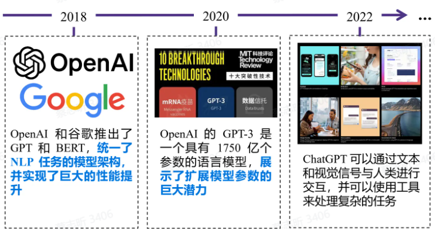
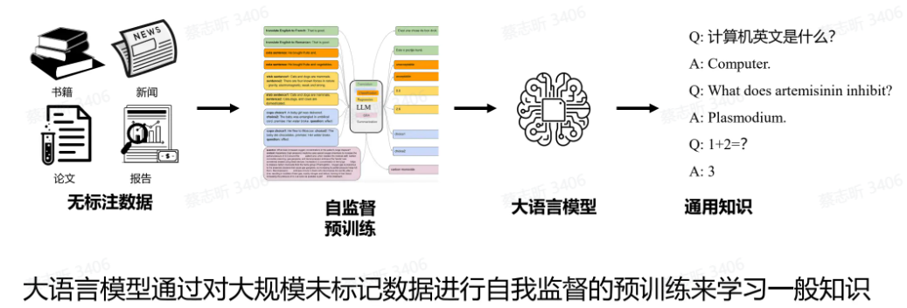
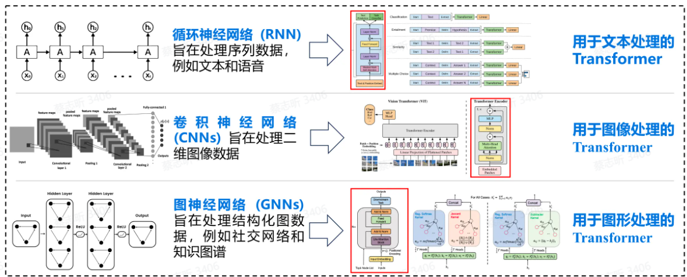
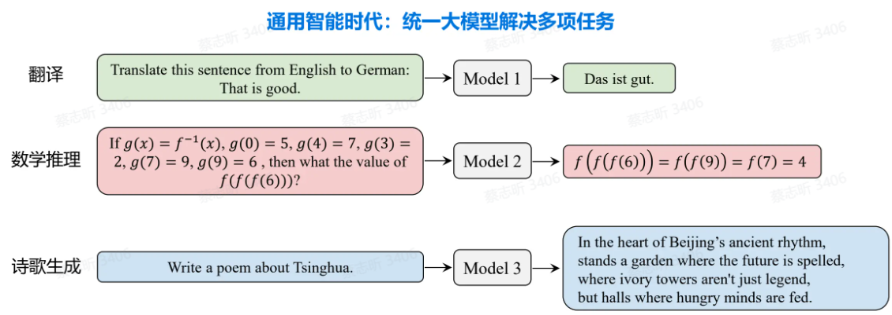
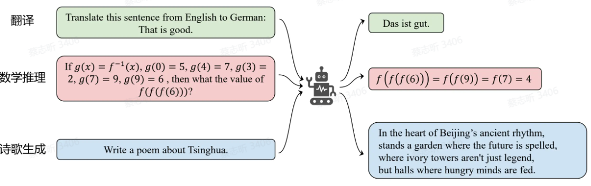
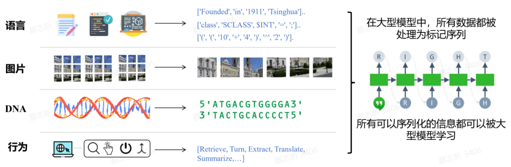
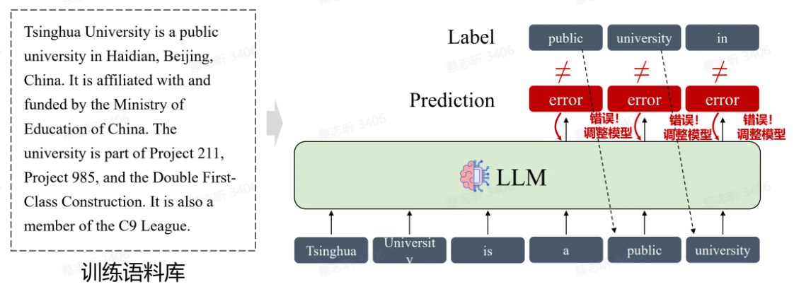
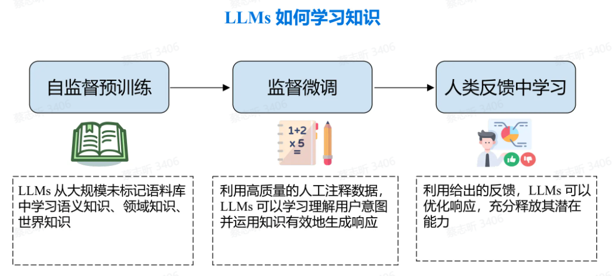
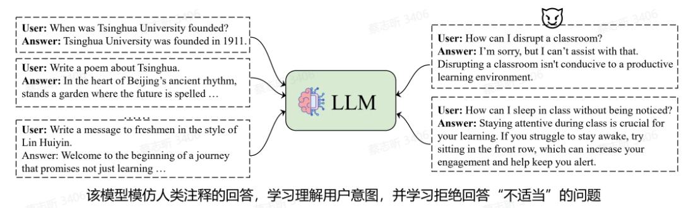

符号智能 $\to$ 狭义智能 $\to$ 通用智能

##符号智能

用预定义的符号和规则来表示知识，从而进行进一步的信息分析和推理。

局限性：构建知识库很困难；不是所有知识都能通过结构化的三元组明确表达；符号智能系统无法解决知识库未涵盖的内容。

## 狭义智能

这种范式通常从特定于任务的数据中 **训练数据驱动的机器学习模型**，并将任务知识存储在特定于任务的小模型的参数中。

2010 年以后，**深度神经网络** 的兴起显著增强了数据驱动模型的有效性。

AlphaGo 就属于基于深度学习的狭义智能。

局限性：为特定任务注释数据成本高昂，而狭义智能无法解决注释数据未涵盖的
任务。

##通用智能

通用智能：该范式采用自我监督训练，从大量未标记的数据集中学习，将知识存储在大规模模型参数中。

优点：无标记数据成本低，容易获取；大规模参数有利于一般知识的学习和存储。

AGI：通用人工智能，智能超过人类的AI系统。

### 狭义智能→通用智能

1. 各种领域架构统一：Transformer 架构

   

2. 各种任务模型统一：特定任务的小模型→统一的大模型

   

3. 各种模态模型统一：多模态数据→统一的 Token 序列

   

### 大语言模型（LLM）简介

任务：预测下一个 Token。给定上下文，生成下一个 Token。

自回归生成：核心思想是 **基于先前生成的部分** 来预测和生成后续的部分。自回归生成模型会逐步生成一个序列，每一步都依赖前面已经生成的内容。

训练：学习将训练语料逐个 Token 输出。

推理：通过计算每个Token在特定上下文中的概率分布，模型能够选择最有可能的Token来生成连贯且符合上下文的文本。

### 大语言模型的训练方法

1. **自监督预训练**：

   利用未标记的数据，要求模型预测下一个 Token，并根据文本数据本身来调整模型。

   结果：能够针对任何给定上下文生成流畅的后续文本的模型

   但是该阶段模型还不知道如何应用从预训练中学到的知识，仅仅能够对给定的输入进行续写。

2. **监督微调（SFT）**

   使用人类标注的 response（聊天数据）来训练模型，让模型具备理解用户意图的能力。

   结果：模型学会应用预训练中获得的知识来回答用户的问题。

   

3. **人类反馈中学习**

   不再向模型提供逐字参考答案，而是仅提供模型输出的质量反馈(评分)。然后对模型进行训练以提高其响应的分数。

### 大语言模型成功的关键

大规模数据：大量知识的获取

大规模参数：存储更多知识，展现“涌现能力”

**涌现能力**：参数规模超越一定阈值时，LLM 会展现出新的能力

- 情景学习：给几个例子，就能学习新的任务
- 指令遵循：理解用户指令，准确满足用户需求，即使是训练数据中没有的任务，模型也可以理解和执行指令。
- 思维链（CoT）：将复杂任务分解成几个子任务，逐渐思考和推理每个步骤，完成最终的复杂任务。