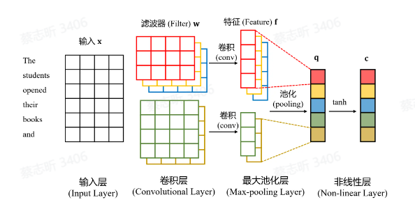

神经网络基础，RNN，CNN，Seq2Seq，Transformer

## 简单神经网络

机器学习。

神经网络：模仿人脑结构设计出来的一种架构，最小的学习单元是 **神经元**。

神经元是一个 **计算单元**，由 n 维输入 $x$，偏置 $n$，n 维权重 $w$，激活函数 $f(z)$ 构成，$w, b$ 是神经元的 **参数**。

单层神经网络：由许多简单神经元连接在一起组成。

多层神经网络：由多个单层神经网络堆叠而成，中间输出被称为隐藏状态。

### 为什么要有激活函数

如果没有激活函数，运算就会退化成简单的矩阵乘法，表达能力会更弱。同时保证层数增加时不会退化成单层的网络。

常见的激活函数：

### 为什么要让神经网络层数变多

单层神经网络表达能力有限，在中间层中可以提取出一些有用的信息。

## 如何训练神经网络

训练目标：在给定的训练样本上，通过优化模型参数，使得模型输出与实际值之间的差异最小化。

$(x_i, y_i) $ 为给定的训练样本， $ x_i $ 是输入， $ y_i $ 是对应的输出， $ i $ 表示样本的编号，共有 $ N $ 个训练样本。希望训练一个神经网络 $ F_\theta(\cdot) $，它将 $ x $ 作为输入，并预测 $ y $。其中 $ \theta $ 是神经网络 $ F_\theta(\cdot) $ 的参数。

训练目标是 **最小化损失函数**，数学表达式为：
$$
\min_{\theta} J(\theta) = \min_{\theta} \frac{1}{N} \sum_{i=1}^{N} l(y_i - F_\theta(x_i))
$$
其中：
- $ J(\theta) $ 是需要最小化的总体损失函数。
- $ l(y_i - F_\theta(x_i)) $ 是单个样本损失函数，用来衡量神经网络预测输出 $ F_\theta(x_i) $ 与真实输出 $ y_i $ 之间的差异。

**随机梯度下降法**：通过对模型参数 $ \theta $ 进行迭代更新，使损失函数逐渐减小，从而找到损失函数的最小值。

更新公式为：
$$
\theta^{\text{new}} = \theta^{\text{old}} - \alpha \nabla_\theta J(\theta)
$$
其中：
- $ \theta^{\text{new}} $ 表示新的模型参数。
- $ \theta^{\text{old}} $ 表示旧的模型参数。
- $ \alpha $ 是学习率，用来控制每次更新的步伐大小。
- $ \nabla_\theta J(\theta) $ 是损失函数 $ J(\theta) $ 对参数 $ \theta $ 的梯度，即导数。

**梯度**：对于一个函数 $ F(x) $，假设函数有 $ N $ 个输入 $ x = (x_1, x_2, \ldots, x_N) $ 和一个输出 $ F(x) $，那么梯度是对每个输入 $ x_i $ 求偏导数所得到的向量，即：
$$
\nabla F(x) = \left[ \frac{\partial F}{\partial x_1}, \frac{\partial F}{\partial x_2}, \ldots, \frac{\partial F}{\partial x_N} \right]
$$
**反向传播（BP）**：反向传播是基于链式法则 **计算梯度** 的过程。它是一种在深度学习框架（如TensorFlow，PyTorch）中广泛使用的算法。

## 循环神经网络和卷积神经网络

语言建模：预测下一个词。

### 循环神经网络 RNN

关键：**处理序列数据时的顺序记忆**

主要思想：一种能够识别 **序列模式** 的机制

递归的更新序列记忆，对序列数据建模。

精髓：隐状态的计算。

$ h_i = \tanh(W_x x_i + W_h h_{i-1} + b) $

- 这是 RNN 单元的隐藏状态更新公式。
- **$ h_i $**：当前时刻 $ i $ 的隐藏状态。
- **$ W_x $**：输入权重矩阵，决定当前输入 $ x_i $ 对隐藏状态的影响。
- **$ W_h $**：隐藏层的权重矩阵，决定上一时刻的隐藏状态 $ h_{i-1} $ 对当前隐藏状态的影响。
- **$ b $**：偏置项。
- **$ \tanh $**：非线性激活函数，常用来增加模型的表达能力，输出值范围在 $[-1, 1]$。
- **$ x_i $**：当前时刻的输入。
- **$ h_{i-1} $**：上一时刻的隐藏状态。

$ y_i = F(h_i) $

- **$ F $**：输出层的函数，可以是一个线性函数，也可以是其他激活函数（如 softmax、sigmoid 等），具体取决于任务类型（分类、回归等）。

RNN 的一个显著特点是它在计算当前输出 $ y_i $ 时，会综合考虑当前输入 $ x_i $ 和上一时刻的隐藏状态 $ h_{i-1} $，从而实现对序列信息的捕捉。

通过循环结构，RNN 可以处理序列数据，使得前一个时刻的信息传递给后一个时刻，适合处理时间序列、自然语言处理等任务。

一个例子：

- 独热向量：词库 $V$ 里有 $|V|$ 个词，可以把每个词看作是一个 $|V|$ 维向量中的一维，$1$ 就表是是这个词。因此每个词都可以表示为一个单位向量。
- 词嵌入：输入 RNN 之前进行 Embedding，矩阵降维。

$h_4$ 里应当包含了前面所有输入的信息，$U$ 是连接隐藏层和输出层的权重矩阵，$b_2$ 是输出层的偏置。softmax 函数的作用是将网络的线性输出转化为 **概率分布**，表示模型认为每个词是下一个词的可能性。

$y_4$ 是一个概率分布，表示在输入句子的上下文中，模型预测下一个词的可能性。每个元素代表词表中对应单词作为下一个词的概率。

### 卷积神经网络 CNN

计算句子中所有 N-gram（表示对于给定序列，连续的 n 个词的子序列） 短语的表示（语言模型的一种退化，只关心最近的 n 个词对下一个词的影响）。

擅长提取局部和位置不变的模式。

移动固定长度的窗口，依次得到特征。

|        | CNNs                     | RNNs                 |
| ------ | ------------------------ | -------------------- |
| 优点   | 提取局部和位置不变特征   | 建模长距离依赖关系   |
| 参数   | 参数更少                 | 参数更多             |
| 并行化 | 在句子内能更好的并行处理 | 不能在句子内并行处理 |

## Seq2Seq 和 Transformers

Seq2Seq：将一个序列转换成另一个序列的任务。

Seq2Seq 模型的主要部分：

- Encoder 编码器：接收输入序列，将其转换为一个固定大小的上下文向量（通常是隐状态表示）。
- Decoder 解码器：用编码器生成的上下文向量，将其解码为目标序列。

最早是用 RNN 做的：

更好的 Seq2Seq 架构：**Transformer**

主要是把处理序列的 RNN 替换掉了。

引入了 **注意力机制**。*（TODO: 读一下 Attention is all you need）*

传统的 RNN 往后推导都是基于 Encoder 把 source 转换出来的中间编码做的，Decoder 推每一个词都是基于这个中间编码来推。但其实 source 里每一个词对于 decoder 中不同的词的影响是不一样的，采用注意力机制为 encoder 中不同的词分配不同的权重，加到输入里。