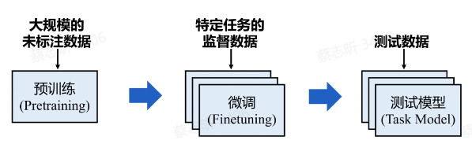
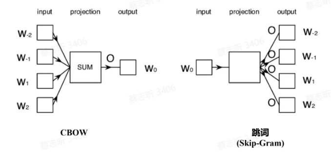
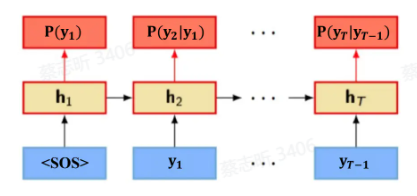
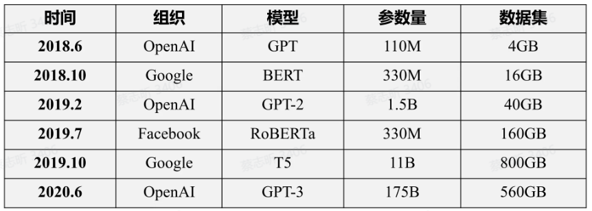

迁移学习，自监督学习，预训练模型（PTMs）

## 迁移学习、自监督学习

深度学习：各类自然语言处理任务（机器翻译，情感分析等）的主流框架。

训练拟合数据的模型，需要 **有监督数据**。

问题：缺乏大规模监督数据，模型深度有限，泛化性能差

解决：先让模型获得一个通用能力，再把这个模型迁移到更小的任务上，拥有特定的能力。

PTMs（预训练模型）先在大规模的未标注数据上进行预训练，然后在下游任务上微调。

**迁移学习** 是一种机器学习技术，它通过将一个领域（源领域）中学习到的知识应用于另一个不同但相关的领域（目标领域）。

**预训练-微调** 范式是迁移学习的一种形式。

- 基于特征的迁移

  将源领域中提取到的特征进行转换，使得这些特征能够在目标领域中有效应用。

- 基于参数的迁移

  将源领域模型的参数（如权重、偏置等）迁移到目标领域中，并通过在目标领域上 **微调这些参数** 来适应新的任务。

  大模型就是基于参数的迁移。

**自监督学习**：从未标注数据中挖掘内部信息来训练模型。

## 大语言模型的预训练

判别模型是不是理解人类语言：模型判断，两个自然语言文本，哪个出现的概率更大（理解那些是人该说的，哪些是不该说的）。

Word2Vec 是一种将单词转化为向量表示的技术，由Google在2013年提出。它通过将每个单词映射到一个低维连续向量空间，使得在这个向量空间中，具有相似语义的词在空间中的距离更近（可以捕捉语言规律）。

1. **CBOW（Continuous Bag of Words，连续词袋模型）**：
   - 该模型根据上下文中的多个单词来预测当前目标词。
   - 举例来说，给定一个句子中的几个上下文词汇，CBOW模型试图预测出中间的词。
   - CBOW擅长处理小数据集，且效果较稳定。

2. **Skip-Gram**：
   - 与CBOW相反，Skip-Gram模型是给定一个目标词，来预测其周围的上下文词汇。
   - Skip-Gram在处理大规模数据时效果更好，尤其是对于稀疏的词汇数据。

Word2Vec 的缺陷：语言的二义性。

因此，需要更长的上下文信息。

在海量文本数据上训练 RNN，用 RNN 建模自然语言概率。

## 预训练模型和大语言模型

2018年，以 ELMO、BERT 为代表的预训练模型给 NLP 领域带来了一场革命。

基于预训练模型的工作在几乎所有 NLP 任务上都取得了巨大突破，各类基准(benchmark)结果也得到了显著提升。

过去两年，预训练模型的规模每年增长约 10 倍，数据量也随之增长，计算成本也越来越昂贵。

- 大模型具有一定知识，可以进行一定的逻辑推理。
- 大模型具有强大的零样本和小样本（Zero-shot and Few-shot）学习能力，随着模型参数不断增大，这种能力会变得更强。

