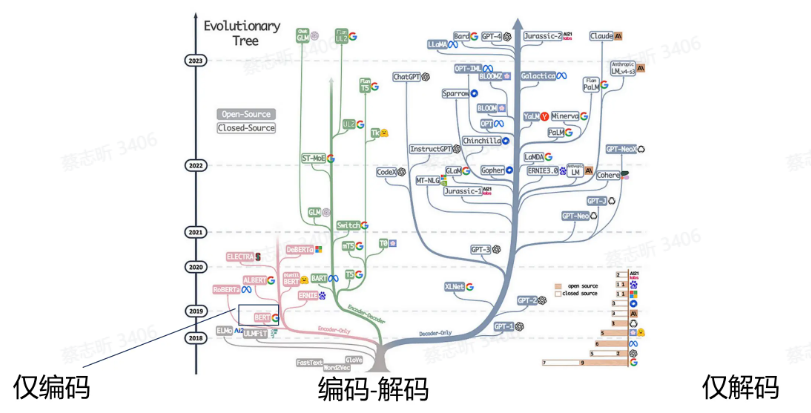
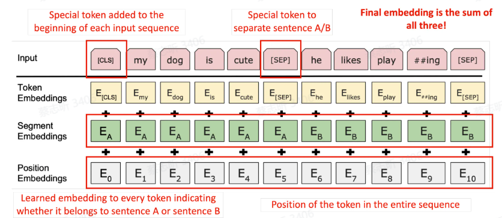
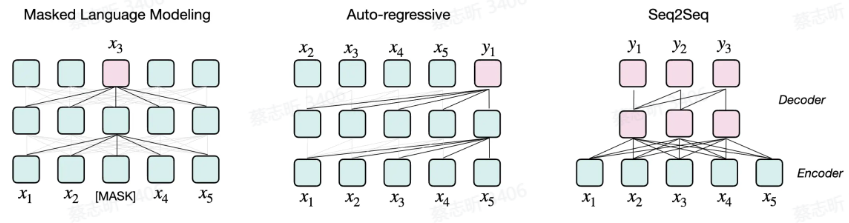
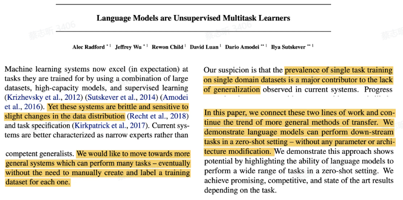
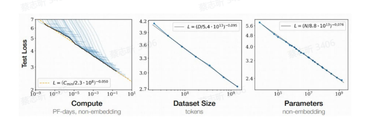

预训练，后训练

## 预训练

### Tokenization

任何信息都可以被转化为 Token，任何 Token 都可以被学习。

训练的第一步：Tokenization，把文本或其他信息分解为一个个离散的单元（Token）。

### Embedding

Tokens 可以用 embeddings（词嵌入，将单词表示为向量，使得相似的单词在向量空间中距离更近）的方式进一步表示。

过去的预训练中，词向量是 **上下文无关的**，会受到语言的二义性的影响。

ELMo：情景化预训练的开始，词向量的表示和上下文有关，每个词向量结合了预训练深度神经网络的所有层。

**Transformer**：注意力机制，很适合训练上下文相关的词向量，每个 Token 会注意到和他相关的上下文 Token。

基于 Transformer 的预训练模型：

- Encoder-Only: Bert
- Encoder-Decoder: T5
- Decoder-Only: GPT

采用了 Transformer 的不同部分，采用不同的目标函数



### GPT

第一个基于 transformer 的预训练语言模型。

从左到右的训练，利用前面的单词的概率预测下一个单词的概率，引入注意力掩码来控制哪些 Token 在注意力计算中是可见的，确保不去看到后面的单词。

### Bert

显著改变 NLP 范式。

方法：对于输入的序列，随机 **遮盖** 掉其中的 k% 部分，然后预测被遮盖掉的词。BERT 中，k=15%。覆盖过少，训练成本高；覆盖过多，上下文不够。

Bert 和 GPT 不一样的地方：Bert 是 **双向的 Attention**，可以看到前后的上下文。

现在更多的模型：单向建模。

另一个目标函数：**理解句子之间的关系**，预测句子 B 是否是句子 A 之后的下一个句子。



三种 embedding：词本身的，词属于哪一个句子，词的位置信息。Token 最终的 embedding：三者都考虑到。

Bert 效果很好，训练了两个模型，Bert base, Bert Large。对 NLP 领域最大的影响：预训练模型 **规模越大，性能更好**。

### T5

把所有任务转换成 Text to Text 的模式。

用 Encoder 进行文本理解，再用 Decoder 生成。

把短语掩盖掉，Encoder 接收被掩盖掉的输入，Decoder 预测。

### 预训练范式

- Masked Language Modeling：像 Bert 那样，挖空，预测被挖空处的词。
- Auto-regressive：像 GPT 那样，仅根据前文内容来预测下一个词。**现在的主流**。
- Seq2Seq：像 T5 那样，Encoder 理解，Decoder 生成。



### 语言建模

用前面的 Token 预测下一个 Token。

语言建模是极致的多任务学习，在建模过程中会学习到各方面的知识能力。

只需要语料，无其他要求。但需要更丰富的数据，数据越多，越智能。

衡量语言建模：**困惑度**，预测下一个 token 的逆向过程。

困惑度通常定义为序列长度（即序列中词的个数）$N$ 和语言模型对词序列的对数概率的关系：
$ PPL = e^{-\frac{1}{N} \sum_{i=1}^{N} \log P(w_i | w_{1}^{i-1})} $

其中，$P(w_i | w_{1}^{i-1}) $ 表示在前面词序列 $w_{1}^{i-1}$ 的条件下，预测词 $w_i$ 的概率。

计算整个文本的出现概率，把它取对数，除以 $N$，取相反数，为了防止他的数量不可读（确保精确度），添加一个指数。

困惑度（Perplexity, PPL）是常用于衡量语言模型好坏的重要指标之一。它描述了模型对于预测某一序列的下一词的可信度和不确定性。简单来说，困惑度越低，表示模型对预测下一词的准确性越高，模型对文本理解得更好。

### GPT-1

1.17 亿参数，处理 7000 本书，先无监督预训练，然后在下游任务上进行监督式微调。

传统 NLP。

### GPT-2

1.5B 参数，学习 40GB 文本，语言模型开始展示其可拓展性。

```tex
当在数百万网页的新数据集上训练时，语言模型开始在没有任何明确监督的情况下学习任务。GPT2在零样本设置中达到了最先进的性能，但仍未充分拟合训练语料库.
```

相关论文：Language Models are Unsupervised Multitask Learners

*TODO：阅读该论文。*



传统的 ML 范式导致了模型不能在多任务上进行泛化，通过扩大预训练的语料，参数，来解决这个问题。

### GPT-3

现代大语言模型的转折点，**泛化性**。175B 参数，学习了 570G 文本。

```
对于所有任务，GPT3 都是在没有任何梯度更新或微调的情况下应用的，任务和少数示例仅通过与模型的文本交互来指定。GPT3 在许多自然语言处理数据集上都表现出色，包括翻译、问答和填空任务，以及一些需要即时推理或领域适应的任务。
```

拥有小样本学习能力与 **情景学习能力（In Context-Learning）**，语言模型仅通过上下文演示就可以执行任务。

把 GPT-3 进行后训练：

- InstructGPT：更好的遵循指令
- ChatGPT：更好的对话

### GPT-4

目前最好的模型，**闭源**。

传统 NLP：人构建一个任务，然后构建一个模型来完成这个任务。

GPT-4：任何可以转化成序列的任务，都可以处理。

### Scaling Law 扩增定律

扩增定律：随着模型大小、数据集大小和用于训练的计算量增加，语言模型的性能会平稳提升。

涌现能力：在模型的规模和复杂性增加到一定程度时，突然显现的、新的和往往是意想不到的能力。这些能力不是通过显式的编程或直接训练获得的，而是从大量数据和高度复杂的模型结构中自然涌现出来。



### 并行计算

ZeRO 框架：数据并行+模型并行