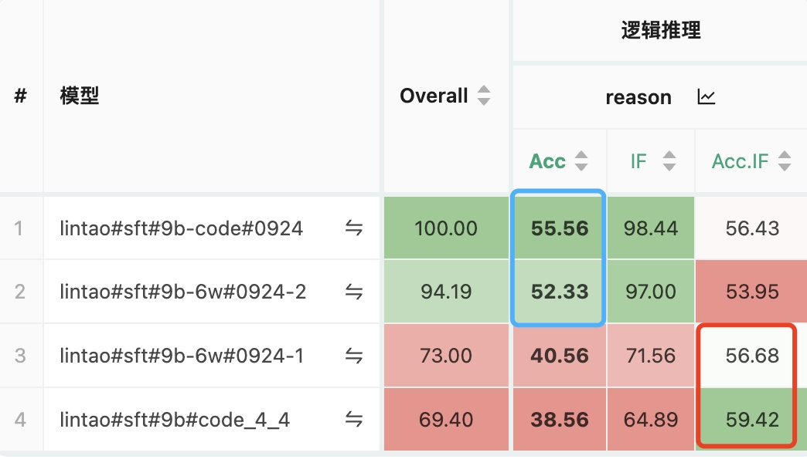

智谱华章科技有限公司 AI 院，2024.9 ~ 2024.11

第一段实习，虽然碍于平日繁忙的学业压力，从事的是互联网打螺丝的工作，但还是记录一下工作内容，方便以后制作简历/与面试官有的聊，足够把这段经历利用起来。

## 算法题目改写复杂指令

题目来源：leetcode, SPOJ, Luogu

不把题目作为算法题目来解答，只是把它当作一个逻辑性的题目，对于给定的输入数据，经过逻辑推理推理得到答案。只有这样的算法竞赛题目才能够集中找到大批量的类似数据。

参考文献：

1. [LogicPro: Improving Complex Logical Reasoning via Program-Guided Learning](https://arxiv.org/abs/2409.12929) （博客站里有该论文的笔记）
2. [LogicGame: Benchmarking Rule-Based Reasoning Abilities of Large Language Models](https://arxiv.org/abs/2408.15778)

旨在提升模型的 **逻辑推理能力与指令遵循能力**。

用构造的数据进行 SFT 实验，在 reasoning 评估集上进行评估，评估结果：



模型现在处理复杂问题，总的可以看成两步：

1. 根据 prompt，给出问题的分步骤解决方式（模型推理能力）
2. 严格按照解决方式正确执行（指令遵循能力）

数据：prompt + response，其中 response = solution + execution 

遇见足够多的问题，可以提升模型推理能力，处理完成足够多的问题，可以提升模型指令遵循能力。

“算法题改写复杂指令”这个数据，prompt 是问题，response 里需要包括上面的两步，不过更看重的是 **指令遵循**。

## 指令遵循评估集构建

构建各种流程类的指令（覆盖面广），prompt 为，问题+解决问题的步骤方法，评估模型是否能一步一步的按照 prompt 给出的步骤方法遵循，得到最终答案。

评估维度包括：指令遵循+正确性

- 指令遵循评估（初步）

  采用模型来评估，prompt如下：

  ```tex
  评估的 prompt：
  下面给你提供【prompt】、【response】内容，你需要判定【response】的回答内容，是否严格按照【prompt】所规定的流程。
  注意，你无需判断【response】的正确性，只需要判断是否遵循【prompt】定义的流程便可，这一条绝对不能违反！
  
  给出你判断的理由，并且最后一行输出 “最终结果：严格遵循|大体遵循|不遵循”：
  
  【prompt】
  
  {{prompt}}
  
  【response】
  
  {{response}}
  ```

  模型评估可能带来潜在的判断精确度降低，不过目前是初步评估，只是看看大体的效果。

- 结果正确性

  对于每个 prompt，首先保证有独一无二的答案（需要限制一下输出格式），然后用字符串匹配的方式来判断 response 的最终结果是否正确。

评估集评测结果：

```tex
glm4-air (32b): 0.547
glm4-public (120b): 0.621
yi-lightning: 0.646
deepseek-chat: 0.663
glm4-public-plus (240b): 0.695
qwen2.5-72b-instruct: 0.704
gpt-4o: 0.753
```

- 对于 glm，尺寸越大，效果越好，而且中间的分数值还是具有一定的差距性

- 各个模型整体评估效果的排序，符合真实表现
