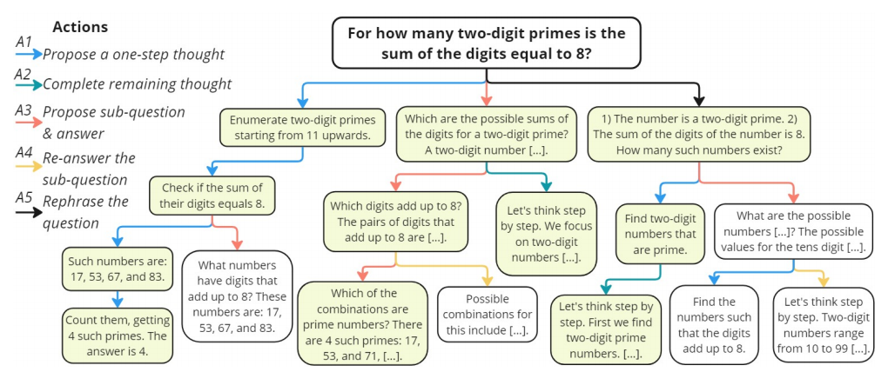
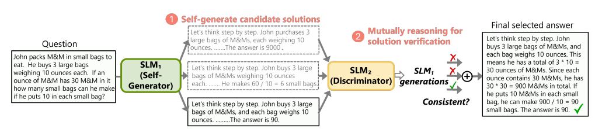

https://arxiv.org/abs/2408.06195

## Introduction

微调可以提高推理能力，但微调数据大多依赖于 GPT-4 等更高级的模型合成。如何在没有高级 LLM 的情况下提高推理能力？

前人方法：利用模型自我奖励反馈来自我探索解决方案。

问题：

1. 推理过程中探索的空间不够广，即使多次尝试，也常常陷入低质量的解决方案中。
2. 即使找到了高质量推理步骤，模型也很难辨别推理步骤质量，难以确定哪些最终答案是正确的，无法对自我探索进行引导。

这种自反馈自我探索得到的结果可能和随机猜测差不多，并且这种问题在小模型中更明显。

## Related Work

- 用 prompt 让模型推理
- LLM 自我提升（微调，prompt，上面说的自反馈）
- 尝试多种推理路径
- 验证答案（用反馈模型验证，但需要额外标注，且可能过拟合；自我验证，但取决于模型本身的推理能力，且很难纠正自己的 response）

## Methodology

### Overview

把用 SLM 解决推理问题表述为多步推理生成任务，这个任务把问题分解成更简单的子任务。这比 CoT 更有效，因为 SLM 单步推理生成一个正确的步骤，比生成完整的推理步骤容易。用蒙特卡洛树搜索（MCTS）来增强 SLM，使得其可以自生成多步推理解决方案。

对于给定的问题和 SLM，MCTS 增强 SLM 使得其增量构建搜索树 T。根节点是原始问题，边表示动作，子节点是在相应动作下生成的中间步骤。每个从根节点到叶子节点的一条路径都是一个解决方案，我们需要找到一个正确的路径。

MCTS 使得 SLM 可以探索和评估多种潜在解决方案，逐渐完善推理步骤，生成正确的推理轨迹。然而，由于 SLM 能力有限，传统 MCTS 作用一般。

方法概述：一个自生成模型，用 SCTS 生成多种推理路径，然后再用另一个鉴别模型对每个路径提供无监督反馈，最后模型根据反馈得到一个最终获得推理路径。

引入了一个更丰富的像人一样的推理动作，使得对推理空间进行彻底全面的探索，设计了一个 SLM 定制奖励函数来对中间步骤进行评估。用另一个 SLM 作为鉴别器来增强 MCTS 过程，和生成器一起相互验证轨迹正确性。

> SLM 定制奖励函数是一种专门的评估指标，用于评估小型语言模型（SLM）在推理过程中生成的中间步骤。其主要目的是在推理过程中提供准确的反馈，从而提升模型解决问题的能力。

### 基于 MCTS 自生成推理路径

MCTS 的核心是动作空间，决定了树探索的范围。大多数 MCTS 方法用单个动作来构建推理树，例如提出下一个子问题或者是生成下一个推理步骤。单一动作类型容易导致空间探索不足。

根据人类的推理过程，引入了一组更丰富的五个动作：

1. 生成下一步
2. 生成剩余的所有步骤
3. 生成下一个子问题及其答案（用 least-to-most prompting）
4. 重新回答 3 的子问题（prompt 模型使用 few-shot CoT）

5. 重新表述问题或子问题（让模型列出所有问题里的条件）

每一步中选择一个动作并基于当前的状态（之前的路径）生成下一个步骤。动作之间有依赖，比如 4 只能在 3 后面，5 只能在根节点之后。

MCTS 的另一个关键在于奖励函数