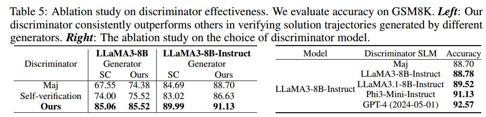

https://arxiv.org/abs/2408.06195

## Introduction

微调可以提高推理能力，但微调数据大多依赖于 GPT-4 等更高级的模型合成。如何在没有高级 LLM 的情况下提高推理能力？

前人方法：利用模型自我奖励反馈来自我探索解决方案。

问题：

1. 推理过程中探索的空间不够广，即使多次尝试，也常常陷入低质量的解决方案中。
2. 即使找到了高质量推理步骤，模型也很难辨别推理步骤质量，难以确定哪些最终答案是正确的，无法对自我探索进行引导。

这种自反馈自我探索得到的结果可能和随机猜测差不多，并且这种问题在小模型中更明显。

## Related Work

- 用 prompt 让模型推理
- LLM 自我提升（微调，prompt，上面说的自反馈）
- 尝试多种推理路径
- 验证答案（用反馈模型验证，但需要额外标注，且可能过拟合；自我验证，但取决于模型本身的推理能力，且很难纠正自己的 response）

## Methodology

### Overview

把用 SLM 解决推理问题表述为多步推理生成任务，这个任务把问题分解成更简单的子任务。这比 CoT 更有效，因为 SLM 单步推理生成一个正确的步骤，比生成完整的推理步骤容易。用蒙特卡洛树搜索（MCTS）来增强 SLM，使得其可以自生成多步推理解决方案。

对于给定的问题和 SLM，MCTS 增强 SLM 使得其增量构建搜索树 T。根节点是原始问题，边表示动作，子节点是在相应动作下生成的中间步骤。每个从根节点到叶子节点的一条路径都是一个解决方案，我们需要找到一个正确的路径。

MCTS 使得 SLM 可以探索和评估多种潜在解决方案，逐渐完善推理步骤，生成正确的推理轨迹。然而，由于 SLM 能力有限，传统 MCTS 作用一般。

方法概述：一个自生成模型，用 SCTS 生成多种推理路径，然后再用另一个鉴别模型对每个路径提供无监督反馈，最后模型根据反馈得到一个最终获得推理路径。

引入了一个更丰富的像人一样的推理动作，使得对推理空间进行彻底全面的探索，设计了一个 SLM 定制奖励函数来对中间步骤进行评估。用另一个 SLM 作为鉴别器来增强 MCTS 过程，和生成器一起相互验证轨迹正确性。

> SLM 定制奖励函数是一种专门的评估指标，用于评估小型语言模型（SLM）在推理过程中生成的中间步骤。其主要目的是在推理过程中提供准确的反馈，从而提升模型解决问题的能力。

### 基于 MCTS 自生成推理路径

MCTS 的核心是动作空间，决定了树探索的范围。大多数 MCTS 方法用单个动作来构建推理树，例如提出下一个子问题或者是生成下一个推理步骤。单一动作类型容易导致空间探索不足。

根据人类的推理过程，引入了一组更丰富的五个动作：

1. 生成下一步
2. 生成剩余的所有步骤
3. 生成下一个子问题及其答案（用 least-to-most prompting）
4. 重新回答 3 的子问题（prompt 模型使用 few-shot CoT）

5. 重新表述问题或子问题（让模型列出所有问题里的条件）

每一步中选择一个动作并基于当前的状态（之前的路径）生成下一个步骤。动作之间有依赖，比如 4 只能在 3 后面，5 只能在根节点之后。

MCTS 的另一个关键在于奖励函数，评估每个动作的价值，指导树的扩展。首先，取消了所有中间结点的自我奖励技术；然后，为了保证泛化避免过拟合，不引入外部监督（如专门训练的价值模型），而是根据每个中间节点对正确答案的贡献对其进行打分，经常推出正确答案的动作会得到更高的奖励。

令 $Q(s, a)$ 表示在动作 $a$ 下生成得到的节点 $s$ 的奖励值，最初所有都为 $0$，当探索到叶子节点时，根据是否得到正确结果，计算奖励值，并返回去更新路径上所有节点的分数（累加）。用自我一致性多数投票的置信度来作为奖励值。

> 在强化学习中，为终端状态分配奖励值对于有效学习至关重要。使用自我一致性多数投票时，置信度由多个输出中一致响应的比例确定。这种方法通过生成多条推理路径，并选择最频繁的答案作为最终输出。该答案的置信度通过与其一致的输出百分比来量化。例如，如果在100个生成的响应中有70个收敛于相同的答案，则置信度为70%。这种方法通过考虑各种推理路径中最一致的结果来提高推理准确性。

从初始节点开始执行各种动作，进行搜索，使用默认展开策略进行模拟，每个节点执行多次移动。

> 在蒙特卡洛树搜索（MCTS）中，默认的展开策略通常在模拟阶段随机选择动作。 这意味着从给定状态开始，动作以均匀随机的方式被选择，直到达到终止状态。 这些随机模拟的结果用于估计初始状态或动作的价值，从而引导搜索朝向更有前途的移动。

用 UCT 来选择每个节点：

$$
\text{UCT}(s, a) = \frac{Q(s, a)}{N(s, a)} + c \sqrt{\frac{\ln N_{\text{parent}}(s)}{N(s, a)}}
$$
其中：$N(s, a)$ 表示节点 $s$ 在之前的迭代中被访问的次数，$N_{\text{parent}}(s)$ 表示节点 $s$ 的父节点被访问的次数 ，$Q(s, a)$ 表示节点的奖励值，$c$ 是一个常量，用于平衡向下深挖和继续探索不同方案。

每个叶子结点的推出过程都表示了一个推理路径，这些路径分别表示一个候选的解决方案。接下来需要验证出他们哪些是有效的。

传统 MCTS 根据某种特定的策略，选择一条路径作为最终的答案，但很难设计一个策略找到一个正确路径。因此，我们提出了答案的相互推理一致性。

对于一条路径，从某一个节点开始把它遮住，然后引入另一个鉴别器来补全剩下的步骤，如果补全出来的路径和原路径相同，则把这条路径看作是有效的路径。最后，对所有有效路径进行分析，把每条轨迹的奖励分数和最后的叶子节点置信度相乘作为最终得分，取最高的轨迹作为最终解决方案。

## Experiments

评估 5 种 SLM：Phi3-mini, LLaMA2-7B, Mistral-7B, LLaMA3-8B, LLaMA3-8B-Instruct，使用了 5 个测试集：数学测试集 GSM8K, GSM-Hard, MATH, SVAMP，以及一个常识推理测试集 StrategyQA。

用 MCTS 增强 SLM，执行 32 次推理，MATH 将深度设为 8，其他评测集设为 5。执行动作 1 和 3 的节点深度最多为 5.用 Phi3-mini-4k 作为鉴别器，鉴别器并行推理。对于给定的路径，随机分 20%~80% 的步骤出来，让鉴别器完成剩余步骤。

Baseline：

1. 单轮 CoT，包括 zero-shot 和 few-shot。
2. 多轮 CoT，使用自一致性方法，用多数投票的方法选择答案。
3. 多轮自我改进方法，选用 ToT（对应动作 1）和 RAP（对应动作 3）。

在推理测试集上评估准确性。提供一个对照：不使用鉴别器，而是使用多数投票来进行答案验证。

Ablation Study（消融实验）

> 消融实验（Ablation Study）是一种在机器学习和深度学习中常用的分析方法，旨在评估模型各个组件或特征对整体性能的影响。通过逐步移除或修改模型的某些部分，研究人员可以观察这些变化对模型性能的影响，从而确定各部分的重要性。这种方法类似于控制变量法，通过控制单一变量来研究其对系统的影响。消融实验有助于理解模型的关键组件和功能，以及它们在特定任务中的作用。

1. 使用不同的 rollout

2. 生成器的有效性：三个 baseline

   - RAP
   - SC
   - 我们提出的生成器，结合自反馈计算奖励分数

   

3. 鉴别器的有效性

   - 两个baseline（多数投票和自我验证），并且使用来自不同生成器的候选解进行评估。
   - 模型选择：更强/更弱。

   