2024 OS 理论复习笔记

[TOC]

## 1. 概论

### 1.1 操作系统的发展变化

#### 1.1.1 批处理

把用户提交的作业成批送入计算机，由作业调度程序自动选择作业运行，在没有人工参与的情况下，顺序执行一系列的程序。

同一时刻只有 **一个软件** 执行，软件运行时，可以 **独占** 全部硬件资源，不支持多用户、多程序同时运行。

- 联机：作业输入输出由 CPU 处理
- 脱机：输入输出脱离主机控制

#### 1.1.2 单道程序、多道程序

多道是指允许多个程序同时进入内存并运行，允许它们 **穿插、交替** 在 CPU 中运行，共享系统资源。

单道是指必须等待前一个程序工作完成后，后一个程序才能进入内存中开始工作，是 **串行** 的。

#### 1.1.3 分时

分时是指多个用户分享使用同一台计算机，多个程序分时共享硬件和软件资源。宏观上用户共享，微观上分时。

将 CPU 处理时间分割为多个时间片，将时间片分给不同程序，达到多个程序“同时”运行的效果。支持 **多用户、多进程**。

#### 1.1.4 网络、分布式

- 网络：联网功能，资源远程访问
- 分布式：多台机器统一管理形成 **单一系统**，对用户和应用高度 **透明**

二者区别：网络操作系统要求网络用户在使用网络资源时首先必须了解网络资源，网络用户必须知道网络中各个计算机的功能与配置、软件资源、网络文件结构等情况，在网络中如果用户要读一个共享文件时，用户必须知道这个文件放在哪一台计算机的哪一个目录下；分布式操作系统是以全局方式管理系统资源的，它可以为用户任意调度网络资源，并且调度过程是 **“透明”** 的。

在整个系统中有一个 **全局** 的操作系统称为分布式操作系统，它由网络作为底层支持。

### 1.2 冯诺依曼体系结构：存储程序式

集中顺序过程控制，由 CPU 控制，并且严格按照程序中指令的顺序来执行。

### 1.3 操作系统的主要功能

- 处理机管理：分配 CPU 时间，进程管理
- 存储器管理：管理缓存、主存、磁盘等所形成的多级存储架构，为多道程序的并发提供良好的环境
- 设备管理：管理输入/输出设备，屏蔽差异性，提供并发访问
- 文件系统：将磁盘变成一个很容易使用的存储媒介提供给用户使用

### 1.4 现代操作系统的基本特征

- 并发执行
- 资源共享（复用）
- 虚拟化管理
- 异步性

### 1.5 操作系统的工作模式

- 用户态（目态）
- 内核态（管态）

### 1.6 特权指令/保护指令

### 1.7 异常：中断、陷入

- 中断主要由I/O设备、处理器时钟或定时器等硬件产生，可以被启用或禁用。中断是一种 **异步异常**。
- 陷阱/陷入是用户进程中某一特定指令执行的结果，在相同条件下，异常可以重现。例如内存访问错误、调试指令以及被零除，系统调用是一种陷入。陷入是一种 **同步异常**。陷入会造成从用户态到内核态的转换。

## 2. 系统引导

### 2.1 OS 分阶段引导过程

#### 2.1.1 加载 BIOS

当打开计算机电源，计算机会首先加载 BIOS 信息。BIOS 中包含了 CPU 的相关信息、设备启动顺序信息、硬盘信息、内存信息、时钟信息等等。在此之后，计算机心里就有谱了，知道应该去读取哪个硬件设备了。

#### 2.1.2 读取 MBR

Master Boot Record（主引导记录），硬盘上第 0 磁头第 0 磁道第一个扇区，存放了预启动信息、分区表信息。

#### 2.1.3 Bootloader

Bootloader：系统加电后运行的第一段代码，内核运行之前运行的一段小程序，可以初始化硬件设备、建立内存空间映射图，为调用操作系统内核做好一切准备。

- Booter **初始化系统硬件**，使其部分运行起来
- Loader 将操作系统映像 **加载到内存中**，跳转到操作系统的代码运行

Bootloader 分为 **stage1 和 stage2** 两个部分。

- stage1：依赖于 CPU 体系结构，用汇编语言来实现
- stage2：用 C 语言来实现复杂的功能，可读性和可移植性好

## 3. 存储管理

### 3.1 存储管理的功能

- 存储分配和回收：算法、数据结构
- 地址变换：可执行文件生成中的 **链接** 技术、程序加载时的重定位技术、进程运行时的软硬件地址变换技术
- 存储共享和保护：代码和数据共享，对地址空间的访问权限
- 存储器扩充

### 3.2 分区存储管理

把内存分为一些大小相等或不等的分区，每个应用程序占用一个或几个分区。操作系统占用其中一个分区。

碎片：内存中无法被利用的存储空间

- 内碎片：分配给作业的存储空间中未被利用的部分。它们被分配出去了，只是没有被利用。
- 外碎片：系统中无法利用的小的 **空闲分区**。外碎片才是造成内存系统性能下降的主要原因。

### 3.3 固定（静态）式分区

把内存划分为若干个 **固定大小**（分区大小可以相等或不等）的 **连续** 分区，程序适应分区。

- 易于实现，开销小
- **内碎片** 浪费；分区总数固定，限制了并发执行的程序数目
- 分区表记录分区的大小和使用情况

### 3.4 可变（动态）式分区

分区的边界可以移动，分区 **大小可变**。

**没有内碎片，但是有外碎片**。

- 首次适应算法：**始端** 开始查找，选择 **第一个足以满足请求** 的空白块，有利于大作业的装入。
- 下次适应算法：从 **上次查找结束** 的地方开始，选择第一个 **足够大** 的空白区
- 最佳适应算法：选择大小 **最接近** 于作业所要求的存储区域
- 最坏适应算法：总是选择 **最大** 的空白区

### 3.5 程序段

- bss 段：存放 **未初始化的全局变量和静态变量**，属于静态内存分配
- data 段：存放 **已初始化的全局变量和静态变量**，属于静态内存分配
- text 段

### 3.6 页式内存管理

- 页面：在分页存储管理系统中，把每个 **作业** 的 **地址空间** 分成一些 **大小相等** 的片，称之为页面或页。
- 页框：在分页存储管理系统中，把 **主存** 的 **存储空间** 也分成 **与页面相同大小** 的片，这些片称为存储块，或称为页框。

#### 3.6.1 地址转换过程

1. 逻辑地址 = 页号 + 页内地址
2. 页表位置 = 页表始地址 + 页号 * 页表项大小
3. 根据计算出的页表位置，读出页表项，从页表项中读出块号（注意页表项还有一些标志位）
4. 物理地址 = 块号 + 块内地址（块内地址 = 页内地址）


#### 3.6.2 多级页表

多级页表结构中，指令所给出的地址除偏移地址之外的各部分全是各级页表的页表号或页号，而各级页表中记录的全是物理页号，指向下级页表或真正的被访问页。

以二级页表为例，地址转换过程如下：

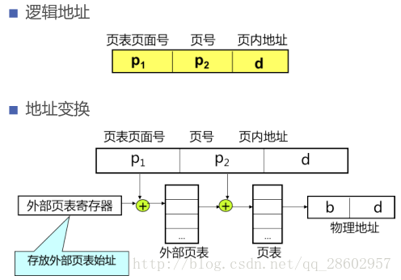

#### 3.6.3 ==页目录自映射==

**构造方法**：

1. 给出一个页表基地址 ${PT}_{base}$，该基地址需要 $4M$ 对齐，即低 22 位全部为 0.
2. 页目录表基址 ${PD}_{base} = {PT}_{base} | {PT}_{base}>>10$
3. 自映射目录表项 ${PDE}_{self_mapping} = {PT}_{base} | {PT}_{base}>>10 | {PT}_{base}>>20$

#### 3.6.4 MMU/TLB

存储管理单元（MMU）包括：TLB，TLB 控制单元，页表查找单元。

MMU 得到虚拟地址后先在 TLB 中查找，如果没找到就去页表里查找，并进行 TLB 重填。

#### 3.6.5 反置页表

按物理页面号排列，表项的内容是 **逻辑页号** 和进程标志符。因此根据虚拟地址进行查找时可能需要遍历整个表来匹配。

反置页表系统 **很难共享内存**，因为每个物理帧只对应一个虚拟页条目。

### 3.7 段式存储管理

或许可以看作是页的大小可变的页式管理？

寻址过程和页表相似，但是页表项中会存储段的长度，需要判断段号是否超过段表长度、段内地址是否超过段长。

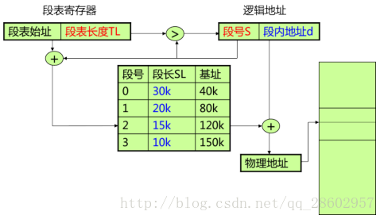

段页式存储管理：把程序分成若干段，把每个段分成若干页。虚拟地址 = 段号 + 段内页号 + 页内偏移。每个进程一张段表，每个段一张页表。


### 3.8 虚拟内存管理

局部性原理：程序在执行过程中的一个较短时期，所执行的指令地址和指令的操作数地址，分别局限于一定区域。表现为时间局部性和空间局部性。

虚拟存储 **把主存看作是磁盘的高速缓存**。

虚拟存储的基本原理：

- 按需装载：只将当前需要执行的部分页或段读入到内存
- 缺页调入
- 不用调出

#### 3.8.1 页面置换策略

- 最优置换：置换掉 **未来最久不被使用** 的页，无法被实现。
- 先进先出：选择 **最旧** 的页换出，性能较差，有 Belady 现象（分配的页面增多，但缺页率反而提高）。
- 二次机会（Second Chance）：每个页面会增加一个访问标志位，用于标识此数据放入缓存队列后 **是否被再次访问过**。A 是 FIFO 队列中最旧的页面，且其放入队列后没有被再次访问，则 A 被立刻淘汰；否则如果放入队列后被访问过，则将 A 移到 FIFO 队列头，并且将访问标志位清除。如果所有的页面都被访问过，则经过一次循环后就会按照 FIFO 的原则淘汰。
- 最近未使用（Clock）：二次机会的改进法，通过一个 **环形队列**，避免将数据在 FIFO 队列中移动。产生缺页错误时，当前指针指向 C，如果 C 被访问过，则清除 C 的访问标志，并将指针指向 D；如果 C 没有被访问过，则将新页面放入到C的位置, 置访问标志，并将指针指向D。
- 最近最少使用（LRU）：设置一个特殊的 **栈**，保存当前使用的各个页面的页面号。每当进程访问某页面时，便将该页面的页面号从栈中移出，将它压入栈顶。栈底始终是最近最久未使用页面的页面号。

### 3.9 工作集策略

工作集：当前 **正在使用** 的页面集合。实际上是一个滑动窗口，和时间与窗口大小有关。

驻留集：虚拟存储系统中，每个进程 **驻留在内存** 的页面集合。

抖动问题：随着驻留内存的进程数目增加，或者说进程并发水平的上升，处理器利用率先是上升，然后下降。因为随着每个进程的常驻集不断减小，缺页率不断上升，频繁调页使得调页开销增大。解决办法：局部置换策略、工作集算法、预留部分页面、挂起若干进程。

### 3.10 写时复制技术（COW）

两个进程共享同一块物理内存，每个页面都被标志成了 **写时复制**。共享的物理内存中每个页面都是只读的。如果某个进程想改变某个页面时，就会与只读标记冲突，而系统在检测出页面是写时复制的，则会在内存中复制一个页面，然后进行写操作。新复制的页面对执行写操作的进程是私有的，对其他共享写时复制页面的进程是不可见的。

简单来说就是，共享页面时，只在一个进程试图写该页面时再复制页面。

### 3.11 内存映射文件

进程通过一个系统调用（mmap）将一个文件（或部分）映射到其虚拟地址空间的一部分，访问这个文件就像访问内存中的一个大数组，而不是对文件进行读写。基本思想是将 IO 变成访存，简化读写操作，允许共享。

## 4. 进程机制与并发程序设计

### 4.1 进程与线程的基本概念

#### 4.1.1 并发与并行

- 并发：两个程序在某一指定的时间，无论二者是在同一处理机上还是在不同的处理机上执行，只要它们都在各自的起点和终点之间的某一处，则称这两个程序是并发执行的。
- 并行：两个程序在同一时间度量下 **同时** 运行在 **不同的处理机** 上，则称这两个程序是并行执行的。

#### 4.1.2 进程与程序

进程是程序的一次执行，是程序在一个数据集合上运行的过程，它是系统进行资源分配和调度的一个独立单位。

进程的特征：动态性、并发性、独立性、异步性

#### 4.1.3 进程的三种状态

- 就绪状态：进程已获得除处理机外的所需资源，**等待分配处理机资源**；只要分配CPU就可执行。

- 执行状态：**占用处理机资源**；处于此状态的进程的数目小于等于CPU的数目。
- 阻塞状态：正在执行的进程，由于发生某种事件而暂时无法执行，便放弃处理机处于 **暂停状态**。

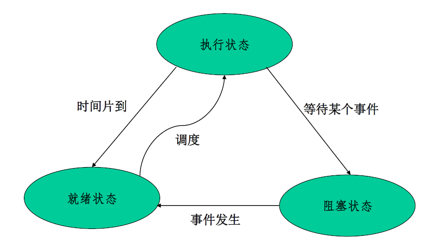

状态转换：

- 就绪 -> 运行
  - 调度程序选择一个进程运行
- 运行 -> 就绪
  - 运行进程用完了时间片
  - 高优先级进程处于就绪状态，运行进程被中断
- 运行 -> 阻塞
  - 当一进程所需的资源必须等待时
  - OS 尚未完成服务
  - 对一资源的访问尚不能进行
  - 初始化 I/O 且必须等待结果
  - 等待某一进程提供输入(IPC)
- 阻塞 -> 就绪
  - 所等待的事情发生

#### 4.1.4 进程的控制原语

原语：由若干条指令所组成的指令序列，来实现某个特定的操作功能。

- 指令序列执行是连续的，不可分割
- 是操作系统核心组成部分
- 必须在 **管态（内核态）** 下执行，且常驻内存

fork() 函数：子进程中返回值为 0，父进程返回子进程的进程 id，出现错误返回负值。

#### 4.1.5 进程与线程

进程包含了两个概念：资源拥有者（进程）和可执行单元（线程）。

线程是进程中的一个实体，是一个 CPU 调度和分派的单位，可以与其它同进程的线程 **共享** 进程拥有的所有资源。

进程是 **资源分配** 的基本单位，线程是 **处理机调度** 的基本单位，所有的线程共享其所属进程的所有资源与代码。

线程的划分尺度更小，并发性更高。

### 4.2 进程通信：同步与互斥

临界资源：一次仅允许一个进程访问的资源

临界区：每个进程中访问临界资源的代码

互斥：某一资源同时只允许 **一个访问者** 对其进行访问，互斥无法限制访问顺序，是 **无序访问**。

同步：在互斥的基础上，通过其它机制实现访问者对资源的 **有序访问**。

#### 4.2.1 忙等待的互斥访问算法

Peterson 算法（两个进程互斥访问）：

```c
void enter_region(int progress) {
    int other;
    other = 1 - progress;
    // 另一个进程的进程号
    interested[progress] = TRUE;
    // 表明本进程感兴趣
    turn = progress;
    // 设置标志位
    while (turn == other && interested[other] == TRUE);
}
void leave_region(int progress) {
    interested[progress]  = FALSE;
}
```

Bakery 算法（n 个进程互斥访问）：

```c
void entrySection(int i) {
    Choosing[i] = true;
    Number[i] = 1 + maxNumber();
    Choosing[i] = false;

    for (int j = 0; j < N; j++) {
        // 等待直到进程j完成编号选择
        while (Choosing[j]) {
            // skip
        }

        // 等待直到编号小于或等于自己的所有进程都离开临界区
        while ((Number[j] != 0) && ((Number[j] < Number[i]) || (Number[j] == Number[i] && j < i))) {
            // skip
        }
    }
}
```

#### 4.2.2 信号量和 P、V 操作

- S.value 为正时表示资源的个数
- S.value 为负时表示等待进程的个数
- P 操作分配资源：`S.value--`，如果无法分配则阻塞（wait）
- V 操作释放资源：`S.value++`，如果有等待进程则唤醒（signal）

#### 4.2.3 管程的基本概念

把分散的临界区集中起来，为每个可共享资源设计一个专门机构来统一管理各进程对该资源的访问，这个专门机构称为管程。

为每个共享资源设立一个管程，对共享资源及其操作进行封装，从而简化对共享资源的互斥访问过程。

其实就是 OO 里的 wait 和 notify ~（这里叫 signal）

针对条件变量 x，`x.wait()` 将自己阻塞在 x 队列中，`x.signal()` 将 x 队列中的一个进程唤醒。

#### 4.2.4 经典的同步与互斥问题

- 生产者-消费者问题

  - 问题描述：若干进程通过 **有限的共享缓冲区** 交换数据。其中，“生产者”进程不断 **写入**，而“消费者”进程不断 **读出**；共享缓冲区共有N个；任何时刻只能有一个进程可对共享缓冲区进行操作。

  - 伪代码：

    ```c
    Semaphore full = 0;
    Semaphore empty = n;
    Semaphore mutex= 1;
    ItemTypebuffer[0..n-1];
    
    producer() {
        while(true){
            生产产品nextp;
            P(empty); // 申请盘子
            P(mutex); // 申请门票，门票只有一张
            buffer[in] = nextp;
            in = (in + 1) MOD n;
            V(mutex);// 释放门票
            V(full);// 释放盘子
        }
    }
    
    consumer() {
        while(true){
            P(full);
            P(mutex);
            nextc= buffer[out];
            out = (out + 1) MOD n;
            V(mutex);
            V(empty);
            消费nextc中的产品
        }
    }
    ```

    注意一定要 **先申请盘子，再申请门票**，否则会造成死锁。

- 读者-写者问题

  - 问题描述：对共享资源的读写操作，任一时刻 **“写者”最多只允许一个**，**而“读者”则允许多个**，即“读－写”互斥，“写－写”互斥，**“读－读”允许**。

  - 伪代码 1：对读者有利

    写者：

    - 开始后，没有其他写者、读者可以进入
    - 必须确保没有正在读的读者，才能开始写
    - 写完之后允许其他读写者进入

    读者：

    - 第一个读者开始读，到最后一个读者结束读之间不允许有写进程进入写过程

    ```c
    Semaphore wmutex = 1; // 表示“允许写”
    Semaphore readcount = 0; // 表示 “正在读” 的进程数
    Semaphore mutex = 1; // 表示对 readcount 的互斥操作
    
    writer() {
        P(wmutex); // 申请写
        write
        V(wmutex); // 释放写
    }
    
    reader() {
        P(mutex); // 申请修改 readcount
        if readcount=0 then P(wmutex); // 第一个读者，申请写
        readcount:= readcount+1;
        V(mutex); // 释放对 readcount 的修改
        read
        P(mutex); // 申请修改 readcount
        readcount:= readcount-1;
        if readcount=0 then V(wmutex); // 最后一个读者，释放写
        V(mutex); // 释放对 readcount 的修改
    }
    ```

  - 伪代码 2：读写公平

    写者出现后，新读者不允许抢在该写者之前进行读操作。
    也就是说：写者出现后，后续读者不允许执行 `rcount=rcount+1`。

    ```c
    Semaphore wmutex = 1; // 表示“允许写”
    Semaphore readcount = 0; // 表示 “正在读” 的进程数
    Semaphore mutex = 1; // 表示对 readcount 的互斥操作
    Semaphore rwmutex = 0; // 互斥信号量，保证写者出现后不会有新的读者
    
    writer() {
        P(rwmutex); // 写者来
        P(wmutex); // 申请写
        write
        V(wmutex); // 释放写
        V(rwmutex); // 写者走
    }
    
    reader() {
        P(rwmutex);
        P(mutex); // 申请修改 readcount
        if readcount=0 then P(wmutex); // 第一个读者，申请写
        readcount:= readcount+1;
        V(mutex); // 释放对 readcount 的修改
        V(rwmutex);
        read
        P(mutex); // 申请修改 readcount
        readcount:= readcount-1;
        if readcount=0 then V(wmutex); // 最后一个读者，释放写
        V(mutex); // 释放对 readcount 的修改
    }
    ```

- 哲学家进餐问题

  - 问题描述：5 个哲学家围绕一张圆桌而坐，桌子上放着 5 支筷子，每两个哲学家之间放一支；哲学家的动作包括思考和进餐，进餐时需要同时拿起他左边和右边的两支筷子，思考时则同时将两支筷子放回原处。

  - 伪代码（基于 AND 信号量集的方法）：

    ```c
    Varchopstick : array[0..4] of semaphore;
    
    think
    SP(chopstick[(i+1)mod 5], chopstick[i]);
    eat
    SV(chopstick[(i+1)mod 5], chopstick[i]);
    ```

- 理发师问题

  - 问题描述：理发店里有 1 位理发师、1 把理发椅和 n 把供等候理发的顾客坐的椅子；如果没有顾客，理发师便在理发椅上睡觉，当一个顾客到来时，叫醒理发师；如果理发师正在理发时，又有顾客来到，则如果有空椅子可坐，就坐下来等待，否则就离开。

  - 伪代码：

    ```c
    int waiting = 0;
    semaphore mutex = 1;
    semaphore custormers = 0;
    semaphore barber = 0;
    
    barber() {
        while (true) {
            P(custormers); // 获取顾客，睡觉
            P(mutex); // 获取 waiting 的访问权限
            waiting--; // 修改 waiting
            V(mutex); // 释放 waiting 的访问权限
            V(barber); // 释放理发师（理发师被唤醒）
            CutHair();
        }
    }
    
    custom_i() {
        P(mutex);
        if (waiting < N) {
            waiting++;
            V(mutex);
            V(custormers); // 增加顾客，唤醒理发师
            P(barber); // 申请理发师
            GetCutHair();
        }
        else {
        	V(mutex);
        }
    }
    ```

### 4.3 进程调度算法

CPU 调度：控制、协调多个进程对CPU 的竞争。

- 高级调度：又称为“宏观调度”、“作业调度”。从用户工作流程的角度，一次提交的若干个作业，对每个作业进行调度。时间上通常是分钟、小时或天。接纳多少个作业？接纳哪些作业？
- 中级调度：内外存交换。从存储器资源的角度，将进程的部分或全部换出到外存上，将当前所需部分换入到内存。
- 低级调度：又称为“微观调度”、“进程或线程调度”。从CPU资源的角度，执行的单位，时间上通常是毫秒。因为执行频繁，要求在实现时达到高效率。

占用 CPU 的方式：

- 不可抢占式：一旦处理器分配给一个进程，它就一直占用处理器，直到该 **进程自己** 因调用原语操作或等待I/O等原因而进入阻塞状态，或 **时间片用完** 时才让出处理器，重新进行。
- 抢占式：就绪队列中 **一旦有优先级高** 于当前运行进程优先级的进程存在时，便 **立即** 进行进程调度，把处理器转给优先级高的进程

评价指标：

- 吞吐量：作业数 / 总执行时间，单位时间 CPU 完成的任务数量
- 周转时间：完成时刻 - 提交时刻
- 带权周转时间：周转时间 / 服务时间（执行时间）
- 平均周转时间：作业周转时间之和 / 作业数
- 平均带权周转时间：作业带权周转时间之和 / 作业数

#### 4.3.1 先来先服务（FCFS）

- 按照作业提交或进程变为就绪状态的 **先后次序**，分派 CPU
- 当前作业或进程占用 CPU，直到执行完或阻塞，才出让 CPU（**非抢占方式**）
- 在作业或进程唤醒后（如 I/O 完成），并不立即恢复执行，通常等到当前作业或进程出让CPU
- 有利于 CPU 繁忙的作业，不利于 I/O 繁忙的作业

#### 4.3.2 短作业优先（SJF）

对 FCFS 的改进，对 **预计执行时间短** 的作业（进程）优先分派处理机。通常后来的短作业 **不抢占** 正在执行的作业。

#### 4.3.3 时间片轮转（RR）

通过时间片轮转，提高进程并发性和响应时间特性，从而提高资源利用率。

流程：

- 【排队】将系统中所有的就绪进程按照 **FCFS** 原则，排成一个队列。
- 【轮转】每次调度时将 CPU 分派给队首进程，让其 **执行一个时间片**。时间片的长度从几个 ms 到几百 ms
- 【中断】在一个时间片结束时，发生 **时钟中断**。
- 【抢占】调度程序据此暂停当前进程的执行，将其送到就绪队列的末尾，并通过上下文切换执行当前的队首进程。
- 【出让】进程可以未使用完一个时间片，就出让 CPU（如阻塞）。

#### 4.3.4 优先级算法

多级队列算法：根据作业或进程的性质或类型的不同，将就绪队列再分为若干个子队列，不同队列可有不同的优先级、时间片长度、调度策略等。

优先级倒置现象：高优先级进程（或线程）被低优先级进程（或线程）延迟或阻塞。

解决办法：

- 优先级置顶：进程进入临界区后，处理机不允许被抢占
- 优先级继承

#### 4.3.5 实时系统的调度

实时系统是一种 **时间** 起着主导作用的系统。当外部的一种或多种物理设备给了计算机一个刺激，而计算机必须在一个 **确定的时间范围内** 恰当地做出反应。对于这种系统来说，正确的但是迟到的应答往往比没有答案还要糟糕。

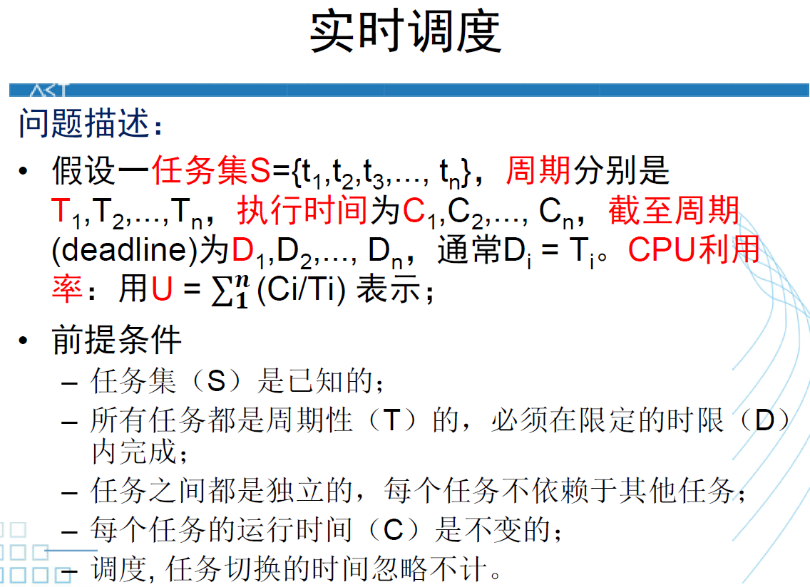

- 单调速率调度（RMS）
  - 优先级静态固定分配：优先级与周期成反比，**周期越短优先级越高**。优先级高的任务先被调度。如果两个任务的优先级一样，当调度它们时，RMS 算法将随机选择一个调度
  - 任务在周期起点释放，高优先级任务 **可抢占** 低优先级任务的执行

  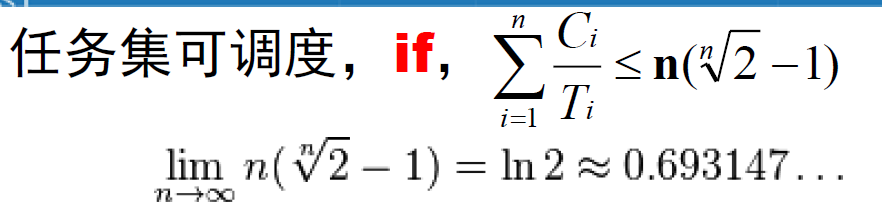
  
- 最早截止时间优先（EDF）

  任务的绝对 **截止时间越早，其优先级越高**，优先级最高的任务最先被调度（**动态优先级**）

- 最低松弛度优先（LLF）

  LLF算法是根据任务紧急（或松弛）的程度，来确定任务的优先级。任务的 **紧急度越高，其优先级越高**，并使之优先执行。
  松弛度（Laxity）= 进程截至时间 - 本身剩余运行时间 - 当前时间进程最晚开始时间（否则就要miss deadline）
  调度时机：有进程执行完或有进程的 Laxity 为 0 时（**抢占**）。

  

### 4.4 死锁

死锁：一组进程中，每个进程都无限等待被该组进程中其它进程所占有的资源，在无外力介入的条件下，将因永远分配不到资源而无法运行的现象。

产生死锁的必要条件：

- **互斥条件**：指进程对所分配到的资源进行排它性使用，即在一段时间内某资源只由一个进程占用。
- **请求且占有条件**：指进程 **已经占有** 至少一个资源，但 **又提出** 了新的资源请求，而该资源已被其它进程占有，此时请求进程阻塞，但又对自己已获得的其它资源保持不放。
- **不可剥夺条件**：指进程已获得的资源，在未使用完之前，不能被剥夺，只能在使用完时由自己释放。
- **环路等待条件**：指在发生死锁时，必然存在一个进程——资源的环形链，即进程集合 ${P_0，P_1，P_2，···，P_n}$ 中的 $P_0$ 正在等待一个P1占用的资源；$P_1$ 正在等待 $P_2$ 占用的资源，……，$P_n$ 正在等待已被 $P_0$ 占用的资源。

处理死锁的方法：

- 不允许死锁发生

  - 预防死锁（静态）：破坏死锁的产生条件。

  - 避免死锁（动态）：在资源分配之前进行判断。

    安全序列：一个进程序列 <$P_1$，$P_2$，...，$P_n$> 是安全的，是指若对于每一个进程 $P_i$，它需要的附加资源可以被系统中当前可用资源加上所有进程 $P_j（j < i）$当前占有资源之和所满足，则 <$P_1$，$P_2$，...，$P_n$> 为一个安全序列。如果系统不存在这样一个安全序列，则系统是不安全的。

    系统进入不安全状态（四个死锁的必要条件同时发生）也未必会产生死锁。但是系统产生死锁后，系统一定处于不安全状态。

    银行家算法

- 允许死锁发生

  - 检测死锁

    资源分配图/进程-资源图：圆圈表示进程，矩形表示一类资源。

    系统中某个时刻 t 为死锁状态的充要条件是t时刻系统的资源分配图是不可完全化简的。

    化简方法：**非封锁进程** 先满足它的资源请求，然后删去其所有的分配边，使其成为孤立节点。

  - 解除死锁

    资源剥夺、撤销进程。

## 5. I/O 设备及控制

### 5.1 I/O 设备

字符设备、块设备、网络设备

块设备：以块为传输单位的设备，每个块可以独立于其他块进行读写。例如：硬盘、CD-ROM、USB盘等。

字符设备：以字符为单位发送或者接收字符流的设备，不可寻址。例如：打印机、网卡、鼠标等。

### 5.2 I/O 控制技术

- 程序控制

  轮询，CPU 向 I/O 模块发出指令，然后进入忙等状态，直到操作完成之后进程才能继续执行。

- 中断驱动

  I/O 操作结束后由设备控制器主动来通知设备驱动程序，而不是设备驱动程序轮询。

- 直接存储访问（DMA）

  由一个专门的控制器来完成数据的传输工作。程序设置控制器中的寄存器值，然后发起 I/O 操作，完成内存与外设的成批数据交换，操作完成时控制器向 CPU 发出中断。

  中断控制方式在 **每个数据** 传送完成后中断 CPU；DMA 控制方式是在要求传送的 **一批数据** 完成之后中断 CPU。

  中断控制方式的数据传送是在中断处理时 **由 CPU 控制** 完成的，由于程序陷入内核，需要保护和恢复现场。DMA 方式下是由 DMA 控制器控制完成的，在传输过程中 **不需要 CPU 干预**，DMA 控制器直接在主存和 I/O 设备之间传送数据，只有开始和结束才需要 CPU 干预。

- 通道技术

  DMA 方式的发展，进一步减少CPU干预。把对一个数据块的读写干预，减少为对 **一组数据块** 读写的干预。

  DMA 控制器通常只能控制一台或者少数几台同类设备；而一个通道可同时控制多种设备。

### 5.3 缓冲技术

缓冲技术可提高外设利用：

- 匹配CPU与外设的不同处理速度
- 减少对CPU的中断次数
- 提高CPU和I/O设备之间的并行性

缓冲区：

- 单缓冲：一个缓冲区，CPU和外设轮流使用，一方处理完之后接着等待对方处理。

  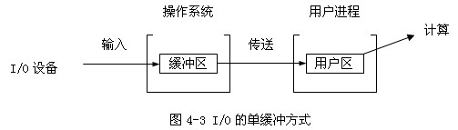

- 双缓冲：两个缓冲区，CPU和外设都可以连续处理而无需等待对方。要求CPU和外设的速度相近。

  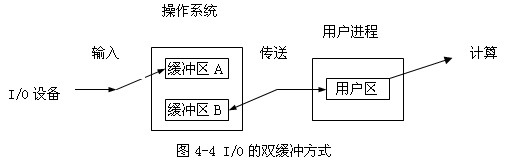

- 环形缓冲：多个缓冲区，CPU和外设的处理速度可以相差较大。

  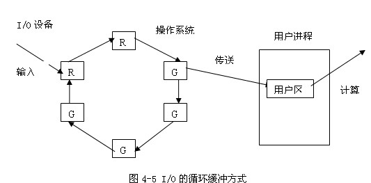

- 缓冲池

### 5.4 假脱机技术

假脱机技术(SPOOLing, Simultaneous Peripheral Operation On Line, 也称为 **虚拟设备技术**)可把独享设备转变成 **具有共享特征** 的虚拟设备，从而提高设备利用率。

应用程序进行 I/O 操作时，只是和 SPOOLing 程序交换数据，可以称为“虚拟 I/O”

应用程序实际上是从 SPOOLing 程序的缓冲池中读出数据或把数据送入缓冲池，而不是跟实际的外设进行 I/O 操作。

高速虚拟 I/O；独享设备的共享

### 5.5 磁盘存储管理

磁盘访问时间：寻道时间 + 旋转延迟时间 + 传输时间

- 寻道时间：启动磁盘的时间 $s$，磁头移动 $n$ 条磁道所花费的时间。
- 旋转延迟时间：$1 / (2r)$

- 传输时间：把数据从磁盘读出，或向磁盘写入数据所经历的时间。与字节数 $b$，旋转速度 $r$ 以及磁道上的字节数 $N$ 有关，$T = b / (rN)$。

磁盘调度算法：

- 先来先服务（FCFS）

  按访问请求到达的先后次序服务。

- 最短寻道时间优先算法（SSTF）

  优先选择距当前磁头最近的访问请求进行服务，主要考虑寻道优先。

- 扫描算法（SCAN）

  当有访问请求时，磁头按一个方向移动，在移动过程中对遇到的访问请求进行服务，到达最后一个柱面后改变移动方向，并为经过的访问请求服务，如此反复。

- 循环扫描算法（CSCAN）

  改进的 SCAN，移动臂到达最后一个柱面后，立即带动读写磁头快速返回到 0 号柱面，返回时不服务。
  
- LOOK
  
  当有访问请求时，磁头按一个方向移动，在移动过程中对遇到的访问请求进行服务，然后判断该方向上是否还有访问请求，如果有则继续扫描；否则改变移动方向，并为经过的访问请求服务，如此反复。

RAID：一种把多块独立的硬盘（物理硬盘）按照不同方式组合起来形成一个硬盘组（逻辑硬盘），从而提供比单个硬盘更高的存储性能和提供 **数据冗余** 的技术。数据冗余的功能是在用户数据一旦发生损坏后，利用冗余信息可以使损失数据得以恢复，从而保障了用户数据的安全性。

## 6. 文件系统

文件的物理结构：

- 连续结构

  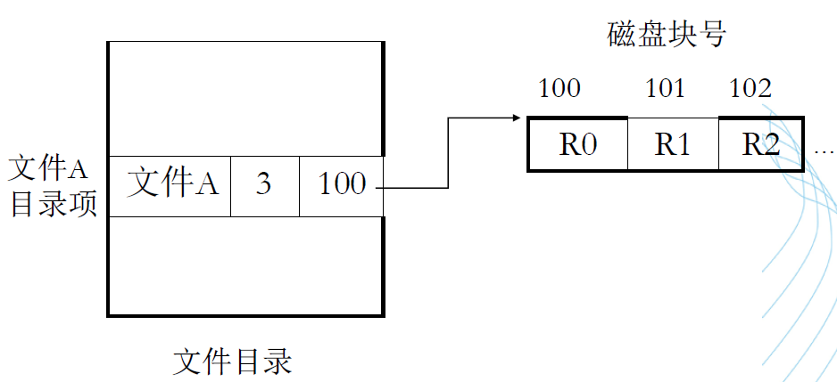

  文件长度一经固定不易改变，不利于文件的动态增加和修改。

- 串联结构

  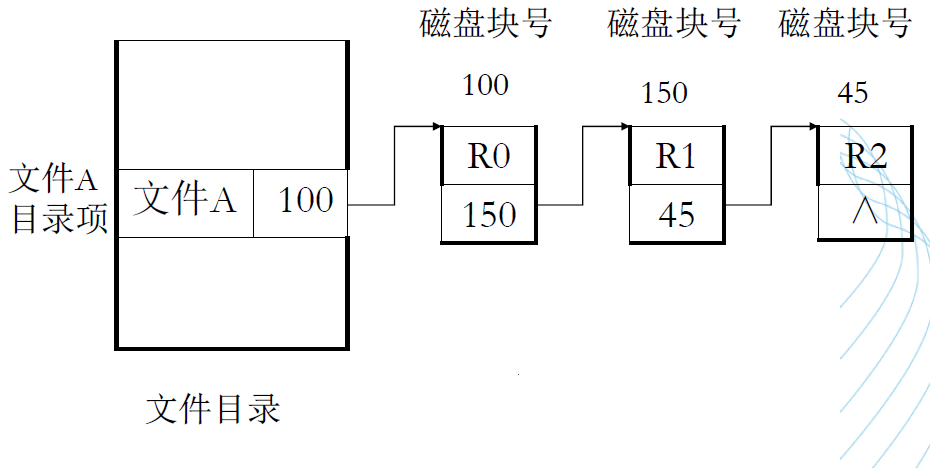

  串联文件结构是按顺序由串联的块组成的，即文件的信息按存储介质的物理特性存于若干块中（不一定连续）。

- **索引结构**

  一个文件的信息存放在若干个 **不连续物理块** 中，系统为每个文件建立一个专用数据结构：索引表，并将这些物理块的块号存放在该索引中。索引表就是磁盘块地址数组，其中第 i 项指向文件的第 i 块。

  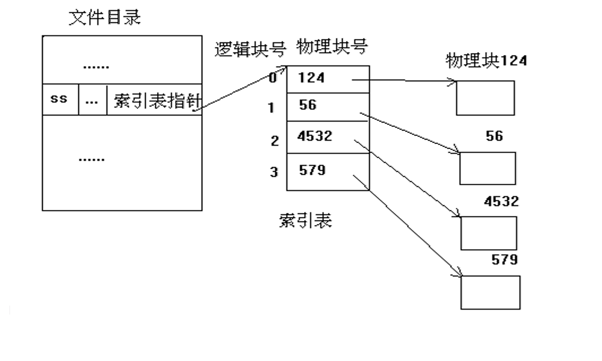

  多级索引：将一个大文件的所有索引表（二级索引）的地址放在另一个索引表（一级索引）中。

磁盘空间管理：

- 空闲表

- 空闲链表

  将所有的空闲盘区连成一条空闲链，可有两种方式：空闲盘块链、空闲盘区链（每个盘区里包括若干盘块）。

- 位示图

  用一串二进制位反映磁盘空间中的分配使用情况，每个物理块对应一位, 已分配物理块为 1，否则为 0。

- 成组链接法

  把空白物理块分成组，再通过指针把组与组之间链接起来，这种管理空白块的方法称为成组链接法。

## 7. 易错题目

### 7.1 内存管理

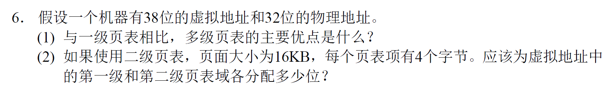

由二级页表的页面大小可以推出二级页表域的位数（第几个 **页表项**？），物理页框大小与页面相同，因此也可以推出物理页框内偏移量的位数（第几个 ==**字节**==？）

注意查页表的最后一步应该是精确到字节。

### 7.2 进程同步与互斥

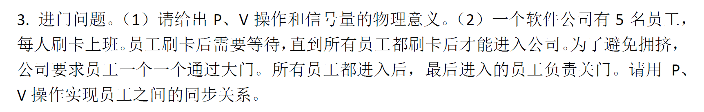

1. P操作申请资源，V操作释放资源；信号量大于0时，表示资源的个数；信号量小于0时，绝对值表示等待进程的个数。

2. ```c
   n = 5 // the number of 员工
   count = 0 // 到达汇合点的线程数
   mutex = Semaphore(1) //保护 count
   barrier = Semaphore(0) // 线程到达之前都是0或者负值。到达后取正值
   
   第i个员工（）{
       P(mutex);
       count = count + 1;
       if (count == n) 
       	V(barrier); // 唤醒一个线程
       V(mutex);
   
       P(barrier);
       V(barrier); // 一旦线程被唤醒，有责任唤醒下一个线程
   
       P(mutex);
       count = count - 1;
       if (count == 0) 
       	P(barrier); // 关门
       V(mutex);
   }  
   ```

### 7.3 磁盘缓冲区计算

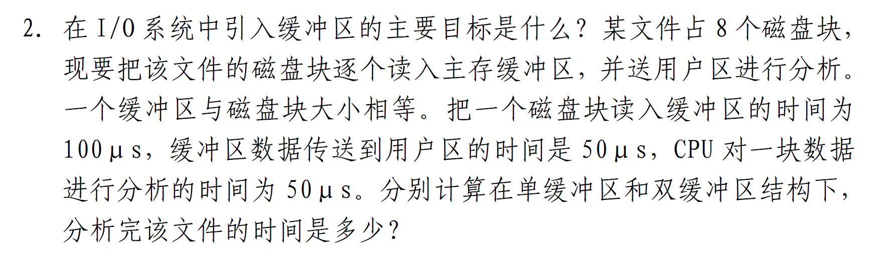

关键在于，**CPU 处理数据可以和 I/O 进程并行**。即“把一个磁盘块读入缓冲区”和“CPU 对一块数据进行分析”可以同时进行。而对于双缓冲区，CPU 和 I/O 进程可同时分别使用两个缓冲区中的一个。

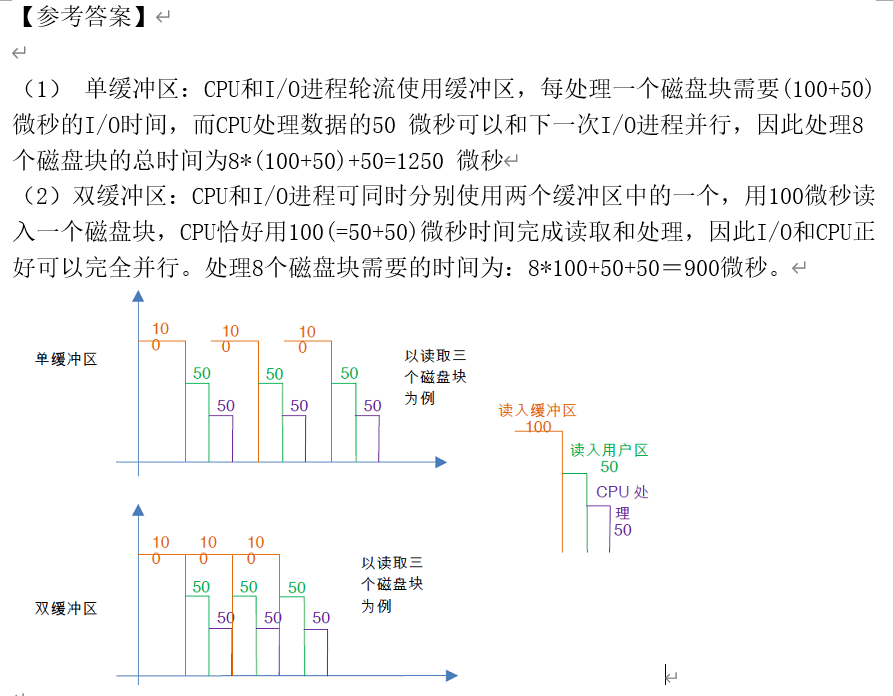

### 7.4 文件系统

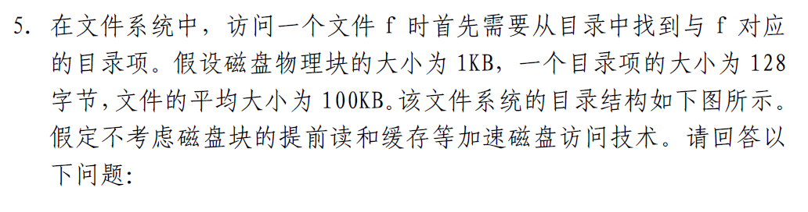


**重要！** 关键是要理解文件系统中 **“块”** 的概念，块是文件系统中的基本管理单位，每一次访问磁盘都是访问一整个块的内容。

“平均”，即（最大找到次数 + 最小找到次数）/ 2，可以用等差数列求和来理解。
