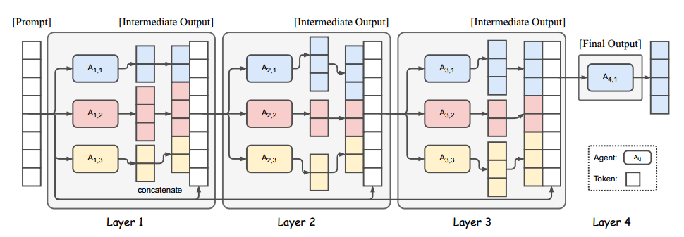
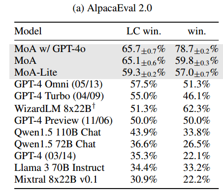
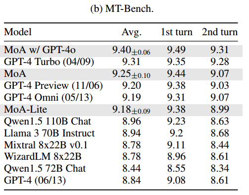
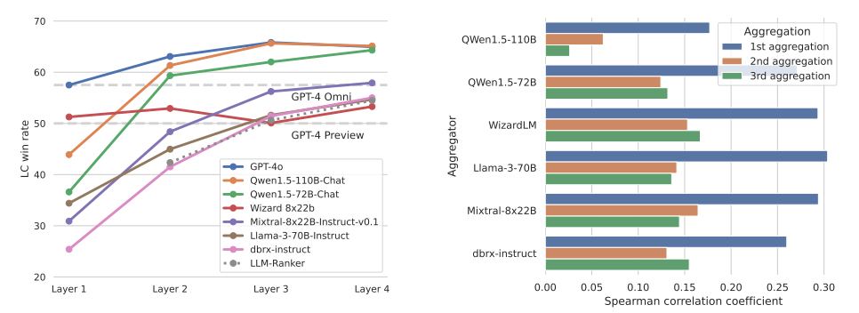
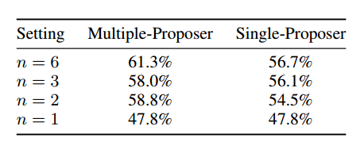
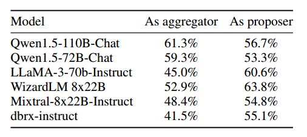
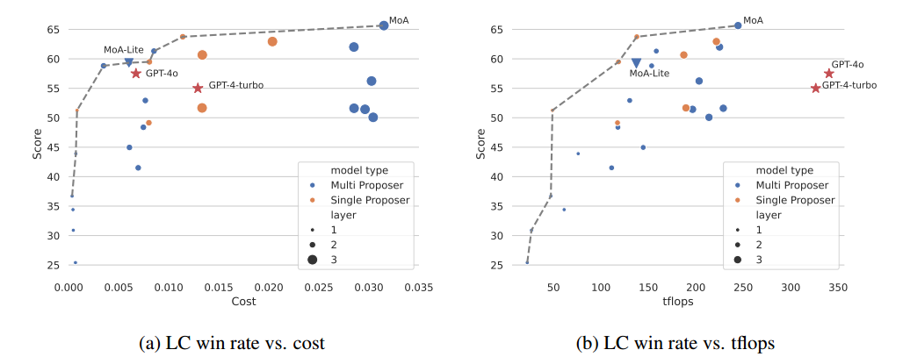

重点：看看方法，实验是怎么做的，怎么评估，用的什么 benchmark。

## Abstract

MoA 分层体系结构，每一层包含多个 LLM agent，每一层的 agent 借助前一层的 agent 输出作为辅助信息来响应。

MoA 模型在 AlpacaEval 2.0（用于评估预训练语言模型性能的工具）, MT-Bench（针对机器翻译任务的基准测试集合）和 FLASK（用于评估大型语言模型安全性和知识的框架）上性能优越，超过了 GPT-4 Omni。

## Introduction

虽然 LLM 的数量大成效好，但存在模型大小和训练数据的局限，扩大这些模型开销比较大。

不同模型在不同任务下具有不同的能力，能否利用多个大模型所有的专业知识来创造一个更强的模型？

给 LLM 提供其它模型的输出后，LLM 可以生成更好的回答，即使这些其它模型本身的能力比较差。

MoA 利用多个 LLM 来迭代提高生成质量，第一层的 $n$ 个 LLM $A_{1, 1}, A_{1, 2}, ..., A_{1, n}$ 对给定的 prompt 独立生成回答，然后提供给第二层的 n 个 LLM，以此循环，直到生成一个优质的回答。

为每个层选择 LLM 至关重要，选择过程有两个标准：

- performance metrics：average win rate
- diversity considerations：多样性

多维评估：AlpacaEval 2.0, MT-Bench (Zheng et al., 2023), FLASK (Ye et al., 2023) benchmarks.

## Mixture-of-Agents Methodology

介绍论文提出的方法，先阐述 LLM 的协同性，然后介绍 MoA 方法。

### LLM 的协同性

把 LLM 分成两种角色：

- **Proposers（提议者）**：生成有用的 response 供其他模型使用。它不一定能产生最好的 response，但应该提供更多上下文背景和不同的观点，从而有助于 aggregator 生成更好的 response。
- **Aggregator（整合者）**：将其他模型的 response 合成为一个高质量 output。它需要保证 output 的质量。

许多 LLM 具有两种角色的能力，有的模型擅长其中一种。

 GPT-4o, Qwen1.5, LLaMA-3 是通用模型，具有两种角色能力。

WizardLM 是好的 Proposer，不是好的 Aggregator。

整合者可以在其他模型输出的基础上生成高质量 response，可以用多个整合者来重复这个操作，先用一些整合器获得一些高质量 response，然后再依据这些新获得的高质量 response 来重新整合。

### MoA



每一层有 n 个 LLM，LLM 在同层或不同层里都可以复用。当一层中有许多相同的 LLM 时，这个结构和一个可以生成多种可能的 output 的模型差不多，把这个结构叫做 single-proposer，结构中只有一小部分模型被激活。

每一层模型集会有一个输入 x（第一层的输入就是用户给的），把这个输入给这一层的所有模型，把这些模型的结果按照下面的提示词模板连在一起，并添加最开始的用户输入，作为下一层模型集的输入。最后一层应当只有一个模型，这个模型的输出就是最终的输出结果。

```tex
You have been provided with a set of responses from various open-source models to the latest user query. Your task is to synthesize these responses into a single, high-quality response. It is crucial to critically evaluate the information provided in these responses, recognizing that some of it may be biased or incorrect. Your response should not simply replicate the given answers but should offer a refined, accurate, and comprehensive reply to the instruction. Ensure your response is well-structured, coherent, and adheres to the highest standards of accuracy and reliability.
Responses from models:
1. [Model Response from Ai,1]
2. [Model Response from Ai,2]
...
n. [Model Response from Ai,n]

```

### 类比 MoE

MoE（Mixture-of-Experts），一种机器学习中的成熟技术，不同的 expert network 专注于不同的技术方面，这个方法获得了成功，MoA 是从这个方法里获得的灵感。

MoE 的每一层有 n 个 expert network 和一个 gating network，和用来改善梯度流的 residual connection。

MoA 是在模型层次进行操作，而不是激活层次，只通过 prompt 进行操作，不修改内部，用一个 LLM 来起到 gating network 和 expert network 的作用。

MoA 只依赖于模型已有的提示词功能，因此不需要进行微调，没有计算开销，并且很灵活，有可拓展性，可以应用于任何最新的 LLM。

## Evaluation

1. 只用开源模型，部分指标优于 GPT-4o
2. 大量实验有助于了解 MoA 内部机制
3. 成本效益提高两倍以上，并提供与 GPT-4 Turbo 相当的性能

### Setup

- Benchmark

  主要在 AlpacaEval 2.0 (Dubois et al., 2024) 上进行评估，包含 805 条实用指令，每个模型的回答与 GPT-4 进行对照比较，再用 GPT-4 作为评估者，得出使用者更喜欢被评估模型回答的可能性。采用了 length-controlled win rate，来消除 length bias。

  还在 MT-Bench 和 FLASK 上进行评估，MT-Bench 用 GPT-4 来给模型的答案打分，FLASK 的评估更加精细，包含了 12 个特定技巧的评分。

- Models

  MoA 用开源模型来构建，包括 Qwen1.5-110B-Chat (Bai et al., 2023), Qwen1.5-
  72B-Chat, WizardLM-8x22B (Xu et al., 2023a), LLaMA-3-70B-Instruct (Touvron et al., 2023b), Mixtral-8x22B-v0.1 (Jiang et al., 2024), dbrx-instruct (The Mosaic Research Team, 2024). 构建了三层，每一层中使用相同的模型集，用 Qwen1.5-110B-Chat 作为最后的整合者。

  开发了一个变体 MoA w/ GPT-4o，用 GPT-4o 作为最后一层的整合器，生成更高质量的输出。

  另一个变体 MoA-Lite 强调性价比（考虑成本），模型集相同，但是只构建了两层，用 Qwen1.5-72B-Chat 作为整合器。这让它比 GPT-4o 更便宜，并且在 AlpacaEval 2.0 上比 GPT-4o 强出 1.8%。

### Benchmark Result

- AlpacaEval

  与 GPT-4 这样的 leading models 和其它优秀的开源模型进行比较，结果如下表。只用开源模型就比 GPT-4 好，并且注重经济效益的轻量版 MoA-Lite 也比 GPT-4 好一些。说明在各种算力下，我们的方法都可以充分利用开源模型，发挥出它们的最大潜力。

  

- MT-Bench

  在 MT-Bench 上的改善相对来说不是特别明显，因为现有模型在这个 Benchmark 上表现已经很好了，都可以获得 9/10 的分数。不过 MoA 还是保持在榜首。这表明，即使是在这种被高度优化的基准，MoA 也可以进一步把边界拓宽，保证领先地位。

  

- FLASK

  FLASK 对模型进行更加细致的评估。在 robustness, correctness, efficiency, factuality, commonsense（具有常识的）, insightfulness（洞察力）, completeness（完备性）, 方面优于 Qwen-110B-Chat，在 correctness, factuality, insightfulness, completeness, and metacognition（元认知） 方面优于 GPT-4 Omni。MoA 在 conciseness（简洁性）指标上做的不好。

### What Makes Mixture-of-Agents Work Well?

进行实验，更好的理解 MoA 的内部机制。

- MoA 表现得比 LLM-ranker 要好。LLM-ranker 是指，用一个整合器来从提议者给出的答案中 **选择** 一个，而不是生成一个新的答案。结果如下图，可以看出 MoA 远比 LLM-ranker 要好。这表明整合器不是简单的选择，而是进行聚合。

  

  MoA 的提议者都一样，选用不同的模型作为最后的整合器。

- 模型多样性和提议者数量的影响。通过改变每层的提议者数量，分析提议者数量对结果质量的影响。结果如下表，表明提议者越多，辅助信息越多，结果质量越好。比较了每层 n 个回答是用同一个 LLM 还是不同的 LLM，发现 multiple 的结果更好一些。这两个结果都表明，在每层里有更多不同的 LLM 可以提高性能。

  

- GPT-4o, Qwen, LLaMA-3 在辅助和整合上都表现很好，WizardLM 是好的提议者，不是好的聚合者。

  

###  Budget and Token Analysis

分析 budget，token usage，LC win rate 之间的关系。



tflops：GPU 每秒可执行的浮点操作次数，是衡量 GPU 性能的指标，在此代指 latency（衡量系统处理一个请求所需的时间，即处理单个任务的效率。因为延迟与整个系统有关，因此用 tflops 来代指）。每一层取最大 tflops，然后求和，因为可以并行。

画了一个 Pareto frontier，可以选取分数高，成本低的模型。发现 GPT-4 不在这个线上，他们不是成本最优的。

GPT-4 的 tflops 未知，用 8x200B architecture 的大小来代替。

- 成本效益：5a 图中计算了所有 AplacaEval 2.0 中每个用例的平均推理成本，cost 是通过 api 提供者的网站上的定价信息来计算出的。Pareto frontier 上的模型在成本和性能之间达到了最佳平衡，更接近这个 frontier 的模型更好，可以用更低的成本提供更高的 LC win rate。考虑生成质量，用 MoA 最好，在质量和成本之间保持平衡，用 MoA-Lite 可以用和 GPT-4o 差不多的成本，达到更高的生成质量。
- tflops 消耗：代指响应速度，避免系统差异
