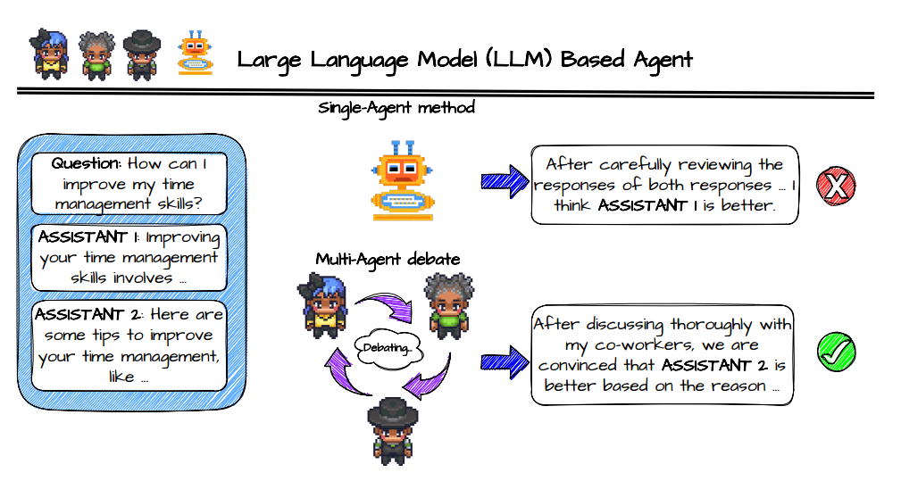
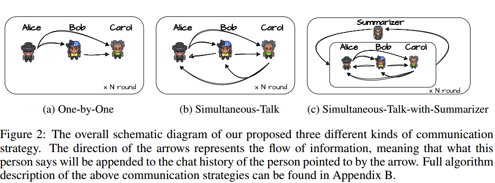

Chateval：通过多智能体辩论实现更好的基于 LLM 的评估器

https://arxiv.org/abs/2308.:07201

## ABSTRACT

LLM 可以代替人类进行文本作品评估评价，单一智能体评估和人类评估质量有差距。多智能体辩论的评估模式。构建了一个 ChatEval 来对模型的生成质量（开放性问题和自然语言生成 NLG）进行评估。**不同的 role prompt** 是必不可少的，如果使用相同的 prompt，会导致性能下降。

https://github.com/chanchimin/ChatEval

##  INTRODUCTION

把多个 LLM 整合到一个集成组中，设计特定的交互机制，不同的 LLM 可以在几轮中提出和仔细考虑各种不同的回复。

ChatEval 中的每个 agent 都被赋予了独特的角色，确保每个智能体都专注于不同的观点，带来特定的专业知识。

1. 提出了一个 ChatEval 框架

   

2. 提出了不同的沟通策略，阐述了在多智能体辩论的场景下，不同的角色 prompt 的重要性

3. release library

##  METHODOLOGY

- 辩手智能体：要求每个 agent 根据 prompt 生成回答，来自其它智能体的回答会作为聊天记录提供给智能体，有一个 prompt 模板。配置好智能体之后，开始分组辩论，每个智能体自主接收其它智能体的回答，并向他们提供自己的回答。整个过程无需人为干预。

- 多样化的角色说明：prompt 模板相同，但是角色描述不同。

- 交流策略：怎么维护聊天记录。

  

  - One-by-One：一个接一个，轮流作答，并把之前智能体的回答直接接到聊天记录模板里提供过去。
  - Simultaneous-Talk：每轮作答顺序不同。
  - Simultaneous-Talk-with-Summarizer：弄了个总结者，每轮让总结者总结消息，加进聊天记录里。

没有明确要求智能体达成共识，从每个 agent 的投票中得出最终结果，或者计算平均得分，保证公平性。