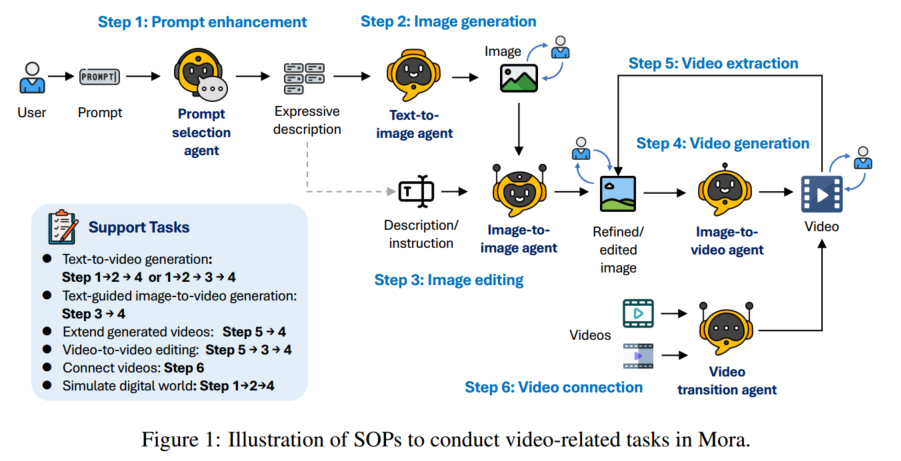
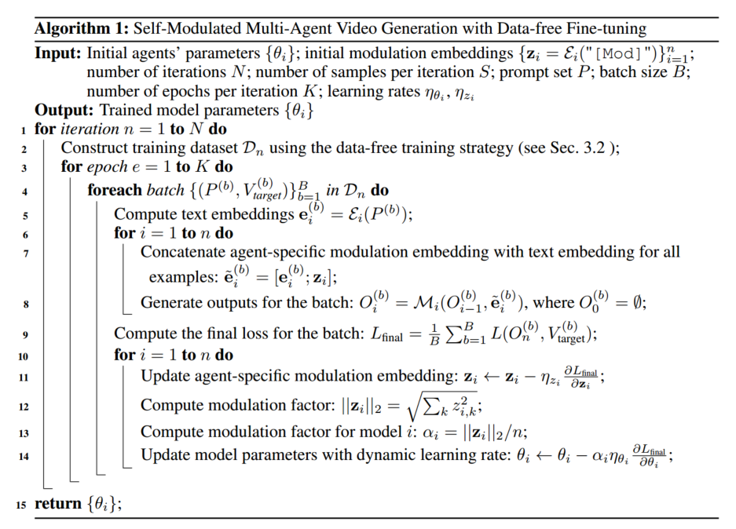

https://arxiv.org/abs/2403.13248 ICLR2025 在投

## 架构

用五个智能体：

1. 提示词选择和生成 $A_1$：用 GPT-4 和 Llama 提取关键信息和动作，分析和强化文本提示词
2. 文生图 $A_2$
3. 图生图 $A_3$：根据文本指令修改图片
4. 图生视频 $A_4$
5. 视频拼接 $A_5$：分析关键帧，识别共同风格和元素，把两个视频拼接到一起

$A_1$ 先优化提示词，使其更适合生成视频，然后让 $A_2$ 生成视频的第一帧，用户如果不满意的话可以重新生成，然后让 $A_3$ 对图片进行调整，再给到 $A_4$ 生成视频。如果用户要将多个视频拼在一起生成一个连贯的视频，让 $A_5$ 做。

## 多智能体微调

对智能体直接 prompt 没有考虑到信息流的向下传播，可能效率低或产生错误；每个智能体对结果的影响不均衡。因此采用端到端训练。

### self-modulated 微调算法

提出一个新方法，modulation embedding，在生成的过程中动态调整每个智能体的影响。平衡每个智能体对最终输出的影响，允许根据当前任务和中间输出动态调整智能体的贡献。

modulation embedding 和 prompt 的文本 embedding 连接，在训练中这个 embedding 会和模型参数一起进行优化，使系统可以学习最佳的合作策略，这可以让每个智能体可以根据前一个智能体的状态调整输出。

**实现**：

先用一个特殊 token 的文本 embedding 初始化 modulation embedding，${z_i = \mathcal{E}_i("[\text{Mod}]")}$，其中 $\mathcal{E}_i$ 是 $A_i$ 的 text encoder。把 prompt 的 text embedding $e_i$ 和 $z_i$ 连接起来得到 $\tilde{e}_i$ 作为智能体的输入。

modulation factor 是 $z_i$ 的欧几里得范式，用来衡量每个智能体的影响。

训练时，目标是让最终输出和目标视频的 loss 最小化，训练过程中梯度下降更新模型参数和 $z_i$。

### 模型筛选数据，人辅助参与

取样出一批候选数据，然后用多模态大模型对其进行评估，如果多个大模型都认为某个视频是最佳的，就把它选进去。如果大模型的评估有差异，就人工评估（选最佳 or 都不选）。

### 无数据训练

在训练中动态合成训练数据，每个智能体都有一个微调参数 $\theta_i$，有一组 prompt，每次都先把这组 prompt 用 $A_1$ 优化，然后生成一组视频，用上面的筛选方法选出一个最佳的，然后用这个最佳的视频以及对应的 prompt 作为下一个 iteration 的数据集，更新每个智能体的微调参数后，又用新的微调参数重复进行上述动作。

## 实验

任务：文生视频，图生视频，延长视频，视频编辑，视频连接，模拟现实世界

数据：

- 文生视频：用 Sora 用的 prompt，再让 GPT-4 生成一些 prompt

- 其它任务：直接利用相关的数据
- 用了 Sora 官网和技术报告上的视频

Baseline：

- 文生视频：Sora (OpenAI, 2024a), VideoCrafter1 (Chen et al., 2023a), MedelScope (Mod), Show-1 (Zhang et al., 2023a), Pika (pik), LaVie and Lavie-Interpolation (Wang et al., 2023a), Gen-2 (Gen, a), and CogVideo (Hong et al., 2022a).

- 其他任务：Sora

指标：

- 文生视频：VBench 的指标
  - 视频质量：对象一致性，背景一致性，运动平滑度，审美得分，动态度，成像质量
  - 条件一致性：时间风格、外观风格

- 其他任务：VideoTI（视频和文本的一致性），TCON（时间一致性，帧之间连贯不跳跃），Tmean（时序连贯性，运动动作自然，动态变化连贯），视频长度
