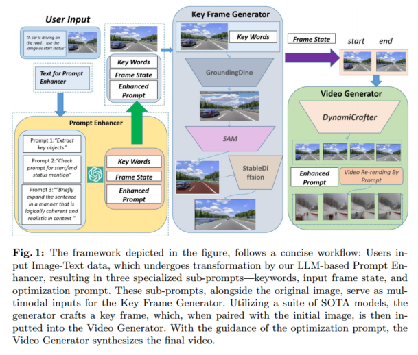
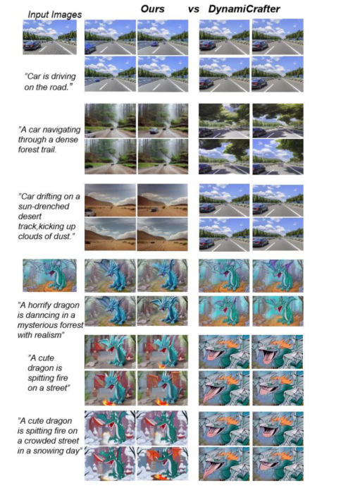

https://arxiv.org/abs/2403.07944

## 架构

组成：prompt 增强器、视频生成器（关键帧生成器、视频生成器）

工作流程（如上图）：输入文本和图像信息，生成关键词、帧状态、增强后的 prompt，然后生成关键帧，最后用关键帧和增强后的 prompt 生成视频。

### prompt enhancer

把输入 $S$ 转成一系列特定任务的 prompt 序列。

### key frame generator

ChatGPT 识别出一些关键对象，然后生成 target mask。

然后用 ChatGPT 提取出的指令 prompt 让 Stable Diffusion Model 生成视频的初始帧和最终帧。

### video generator

用 DynamiCrafter 根据初始帧和最终帧生成无缝帧序列。

## 实验

用一个 4090 来跑。

数据集：AIGCBench。

- 定量评估

  指令对齐、运动效果、时间一致性（视频每一帧联系紧密）、视频质量

- 定性评估

  可控性、灵活性，用 prompt 控制生成过程

  

- 人类评估：指令对齐，运动质量、视觉质量
