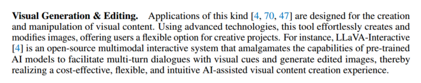
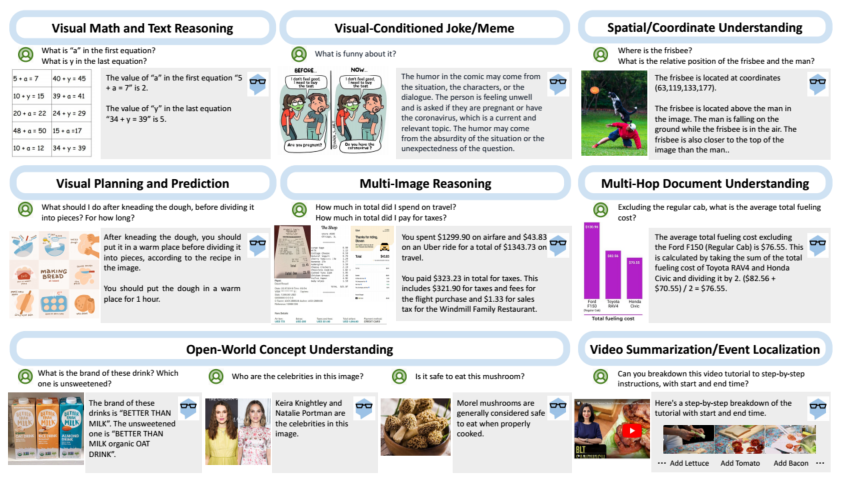
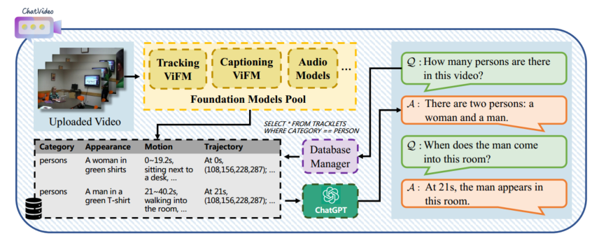
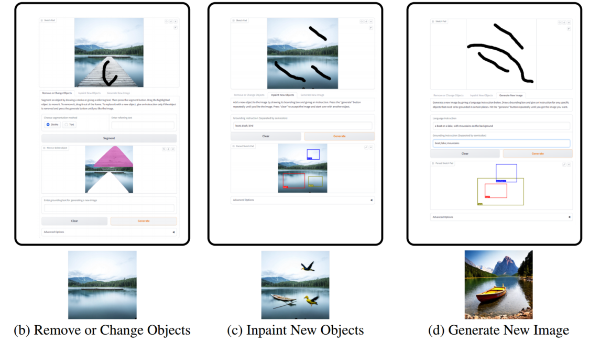
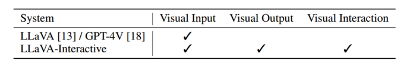

## Large Multimodal Agents: A Survey

https://arxiv.org/abs/2402.15116

综述，介绍了 LMAs 的核心组成、分类、多智能体协作、评估、应用、总结与未来展望

感觉大部分讲的是视觉，以及模拟人类行为相关的，和生成式智能体比较相关的不多。

在应用部分，有一个小块提到了视觉内容生成和编辑。

-  [Llava-interactive: An all-in-one demo for image chat, segmentation, generation and editing.](https://arxiv.org/pdf/2311.00571)

-  [Chatvideo: A tracklet-centric multimodal and versatile video understanding system](https://arxiv.org/abs/2304.14407)

-  [Mm-react: Prompting chatgpt for multimodal reasoning and action.](https://arxiv.org/abs/2303.11381)

看上去只有第一个是生成视频，后两个是视频内容理解，是视频生成文本，后续再看原文。

## MM-REACT: Prompting ChatGPT for Multimodal Reasoning and Action

https://arxiv.org/abs/2303.11381

灵活的把视觉模型和语言模型结合起来，以解决复杂的视觉理解问题。

看起来是一个早期的工作，借助视觉模型把多模态信息转换成文本，让文本模型实现多模态理解。

每当 ChatGPT 需要图像或视频中的内容时，就寻求视觉模型的帮助。在 prompt 里添加每个模型的使用说明，并设置了口令，使得可以通过正则表达式来匹配并调用视觉模型。

## ChatVideo: A Tracklet-centric Multimodal and Versatile Video Understanding System

https://arxiv.org/abs/2304.14407

先全面解析视频，在于用户交互时适当查询有用信息。把视频中对象的运动轨迹作为视频的基本单位，把对象的种类、外观、运动、轨迹存在数据库里，要用的时候就查出来给 LLM 参考做响应。

这项工作和上面的工作，还有一个叫 Visual CahtGPT 的工作，都是为了把 ChatGPT 和现有的视觉模型连接起来（而不是训练新模型），使他们交互，从而实现视觉聊天。

## LLaVA-Interactive: An All-in-One Demo for Image Chat, Segmentation, Generation and Editing

https://arxiv.org/abs/2311.00571

这好像就是实现了个应用。

拼接了三种模型的功能：LLaVA 的 visual chat，SEEM 的图像分割，GLIGEN 的图像生成与编辑。

Related Works 里介绍了当前 LMM 的多模态理解或交互的方法：

- 训模型让模型具有多模态输出能力

  GILL [8], CM3leon [29], Emu [20], DreamLLM [3], Kosmos-G [19] and MGIE [4]. 

- 在模型推理时调用其他视觉模型

  Visual ChatGPT [25], X-GPT [30], MM-REACT [28], VisProg [7], and ViperGPT [21]

实现了：编辑图像，生成新图像，进行与图像内容相关的对话。可以根据用户画的轨迹执行相关操作。

## VideoAgent: Long-form Video Understanding with Large Language Model as Agent
https://arxiv.org/abs/2403.10517

长视频理解。

像人一样理解视频，人是先浏览几帧了解上下文，然后迭代搜索其它帧来收集足够信息回答问题，最后汇总所有信息，做推测。

流程如下：

1. 均匀采样 N 帧，VLM（vision-language model）用文本描述图像，提供给 LLM。
2. 决定下一步是退出搜索回答问题，还是确定还需要哪些信息，继续搜索。根据当前的信息回答问题，然后自我反思评估置信度。
3. 找新帧：LLM 先挑一些视频片段，然后用 CLIP 去匹配与查询文本相似度高的帧。
4. 为新的帧生成描述，然后和之前的描述排序和拼接起来。

## GenArtist: Multimodal LLM as an Agent for Unified Image Generation and Editing

https://arxiv.org/abs/2407.05600

第一个图像生成和编辑合一的系统。

## GENMAC: Compositional Text-to-Video Generation with Multi-Agent Collaboration
https://arxiv.org/abs/2412.04440

重点是关注 Compositional，组合式文本。

“第一个用多智能体协同解决组合文本生成视频的范式”。

> 组合式文本到视频生成（Compositional Text-to-Video Generation）是一种技术，旨在根据复杂的文本描述生成包含多个对象、属性、动作和运动的高质量视频。与传统的文本到视频生成（Text-to-Video Generation）相比，组合式方法更注重将不同的元素组合在一起，以准确反映复杂的场景和动态。

三个步骤，design, generation, redesign.

- design：把文本转换为结构化的布局，让 LLM 为每个帧和每个实例生成边界框，包括其对象id、名称、大小、位置。

- generation：用 text-to-video 模型把结构化布局转化成视频，引入 LVD 方法（Llm-grounded video diffusion models）

- redesign：核心，检测生成的视频和提示词之间的差别，调整 design，采用多个 MLLM 协同的方法

  - 任务分解，每个子任务用一个专门的智能体来解决

    - 验证：存在性、数量、属性、关系
    - 建议：改进设计，选择合适的修正智能体
    - 修正：更改边界框设计和，输出修正方案（三个智能体，时间一致性、动态变化（对象属性更改、动态操作）、运动（对象位置变化），由建议智能体选择）
    - 输出结构化：输出格式化后的 design

    

## Mastering Text-to-Image Diffusion: Recaptioning, Planning, and Generating with Multimodal LLMs

https://arxiv.org/abs/2401.11708

MLLM 来统筹规划管理整个系统。先分解对象和背景信息，或者把编辑操作分解为多个具体的操作；建立一颗树，节点由初始节点、生成节点、编辑节点组成，自修正机制，每个生成节点都有一个由编辑节点构成的子树；然后遍历树，调用工具来进行操作；最后验证。

在调用工具之前，执行一个  Position-Aware Tool，主要是解决输入中提供的位置信息不足的问题。位置信息补充（调用其他工具补充位置信息）、位置信息介绍（对输入图像进行检测分析生成边界框，为 MLLM 提供空间参考）

## Kubrick: Multimodal Agent Collaborations for Synthetic Video Generation

https://arxiv.org/abs/2408.10453

## Anim-director: A large multimodal model powered agent for controllable animation video generation

https://arxiv.org/pdf/2408.09787

## DreamFactory: Pioneering Multi-Scene Long Video Generation with a Multi-Agent Framework

https://arxiv.org/abs/2408.11788

## StoryAgent: Customized Storytelling Video Generation via Multi-Agent Collaboration

https://arxiv.org/abs/2411.04925

## From Sora What We Can See: A Survey of Text-to-Video Generation

https://arxiv.org/abs/2405.10674

## DriveDreamer-2: LLM-Enhanced World Models for Diverse Driving Video Generation

https://arxiv.org/abs/2403.06845

## MultiMedia-Agent: A Multimodal Agent for Multimedia Content Generation

https://openreview.net/forum?id=2JN73Z8f9Q