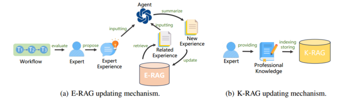

https://arxiv.org/abs/2403.07952

分两部分，Horizontal Layer 和 Utility Layer，可以理解为前者是统筹管理和决策（用了 RAG），后者是一套应用，让每个操作可以执行。

related work 可以看一下里面的内容有没有相关的。

## 架构

### Horizontal Layer

工作流创建，任务规划，数据库更新，prompt 优化。

工作流：剧本生成、图像生成、视频组装

K-RAG 和 E-RAG 优化，一个是已有的知识库，一个在使用过程中根据结果反馈不断更新经验

- 工作流编排

  

  把任务描述和编排工作流的 prompt 输给任务规划 agent，生成工作流 $T$。这个过程中 E-RAG 提供经验建议，并从工作流的后续执行结果处得到反馈，更新知识库。

- prompt 优化

  

  K-RAG 把专家知识融合进 prompt 里，E-RAG 进一步优化 prompt。

  K-RAG 索引和存储专家提供的知识文档，E-RAG 根据结果总结经验并存储。

- 应用调用

  把应用程序及其使用教程写入 K-RAG 的知识库，供智能体查询；E-RAG 不断更新经验。

### Utility Layer

生成 n 个图像，然后合成视频。

- 生成合理的图像

  - 在训练时把一些与构图相关的“magic word”做特殊标注，让图像生成单元可以理解他们的意思，然后用这些 magic word 来描述需求。

  - 合理布局：生成一个框，在框里生成特定的图像。

- 角色一致性

  保证故事的多个图像中，角色外观一致。

  - 改善人物描述

    整体图像描述中加入更详细的角色特征；对每个角色生成单独的角色特征描述。

  - 人物图像修复

    对图像里的角色做 mask，然后在 mask 的区域根据角色描述做修复。

- 图像风格一致性

  保证多个图像的风格一致

  - 图像风格学习

    用同样风格的图像训模型，让他生成出来的图像都是这种风格。

  - 图像风格转换

    ControlNet

- 动态视频合成

  - 动态素材生成

    选择和编辑素材，生成音频和视频素材。

    语音素材：结合背景音乐和音效，并用了 Text-to-Speech 技术

    视频编辑：把图像序列转换成视频，包括详细描述和视觉效果分析、过渡效果

  - 时间线对齐

    防止时间错位

## 实验

举了个例子展示 E-RAG 知识库的更新和其对工作流规划的优化。

举了个例子展示 E-RAG 对 prompt 的优化，并让专业编剧对生成的剧本进行评估（有无 K-RAG 对比，和其它项目对比）

Utility 的选择：一开始用 DALL-E，发现效果不好，agent 搜索到了一种结合 Lora 和 ControlNet 的解决方案，应用并将其纳入 K-RAG 知识库中。

反正就是举了些特定的例子说明自己的这套有用，然后又横向对比了一些其它方法。